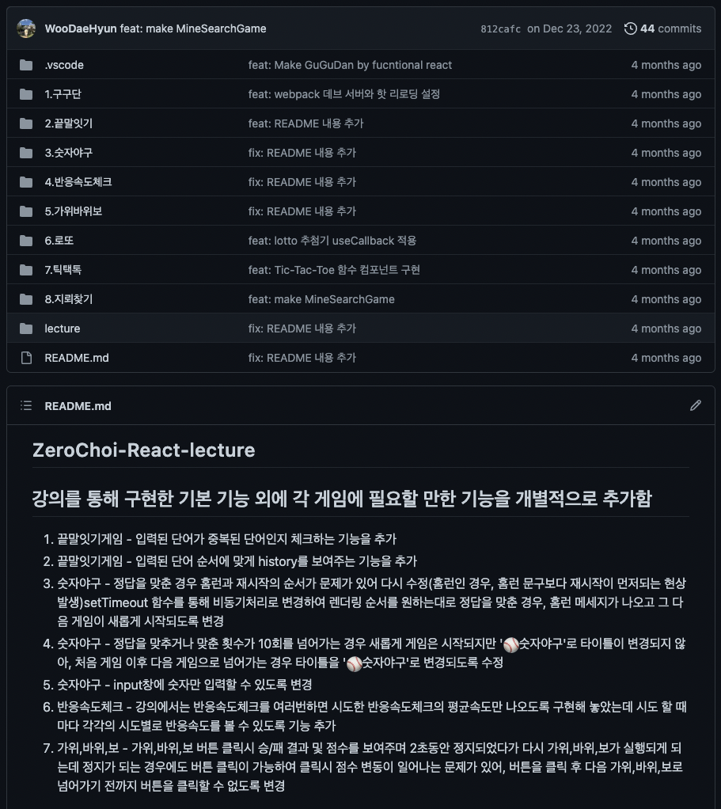

<div>
    
  <br/>
  <h6><a href="https://unsunghero.netlify.app/">⭐️언성히어로 URL</a></h6>
  <br/>
  <h6><a href="https://github.com/WooDaeHyun/FEDC3_UnsungHero_Donggeun">⭐️언성히어로 Github Repo</a></h6>
</div>

<br/>

---

> #### Unsung Hero 소개

- **서비스 대상** : `아버지`
- **서비스 명** : `언성 히어로(Unsung Hero)`
  - **언성 히어로란?** 용기 있는 행동, 자기희생적 행동을 하여 훌륭한 업적을 달성했지만 **유명하거나 알려지지 않은 사람**을 뜻하는 합성어
- **서비스 배경** : 많은 고민을 안고 살아가지만 누구에게도 쉽게 고민을 털어놓지 못하는 **아버지**들을 위한 자유로운 소통, 상담 그리고 위로받는 공간을 만들기 위해 기획
- **서비스 목적** : 자녀가 있는 **아버지**들의 털어놓기 어려운 고민을 서로 편하게 공유하며 도움과 위로를 받을 수 있고 아버지라는 책임에서 벗어나 본인 스스로를 되돌아 볼 수 있는 시간을 갖을 수 있음
- **기대 효과** : **아버지**들의 정서적 안정과 행복을 통한 가정의 평화와 행복

---

> #### 주요 기능 소개

1. **회원가입 및 로그인**
2. **포스트 CRUD**
3. **포스트 댓글 CRUD**
4. **공감 버튼**
5. **알림 기능**
6. **마이 페이지**
7. **검색 기능**

---

> #### 프로젝트 구조

```
public
L index.html
L manifest.json
src
L alarm (알람과 관련된 모든 파일이 들어감)
L auth (로그인, 인증 관련.)
L comment (댓글 기능관련)
L post (작성된 글 관련)
L search (검색 기능관련)
L styles (프로젝트 전체적인 스타일)
L user (사용자 본인에 대한 기능들)
App.tsx
Router.tsx (라우터 설정)
index.tsx
```

&nbsp;&nbsp;나를 포함한 언성히어로 팀원들 중 1분을 제외하고는 전부 **첫 팀 프로젝트**이기 때문에 **폴더 구조**를 간단하고 직관적으로 가져가기로 결정했다. 따라서 먼저 프로젝트를 **기능별로 분류**하고 `src`폴더 내 폴더들을 `기능별`로 분류하여 관련된 컴포넌트들을 **해당 기능별 폴더**내에 모두 넣기로 했다. 해당 방식으로 폴더 구조를 설계한 경우에 **장점**과 **단점**이 명확했다.

- **장점**
  1. **직관적이다.** 기능별로 분류되어 있기 때문에 프로젝트의 기능들을 직관적으로 확인할 수 있고 해당 기능들과 관련된 컴포넌트들도 직관적으로 확인할 수 있다.
  2. **유지 보수가 용이하다.** 특정 기능과 관련된 컴포넌트들이 모여있기 때문에 쉽고 빠르게 찾을 수 있다.
- **단점**
  1. **구조가 복잡해질수록** 각 폴더가 가지는 파일의 수가 너무 많이 늘어나게 되고 더 나아가 폴더의 depth가 깊어질 수 있어 오히려 **직관성이 떨어질 수 있다.**

&nbsp;&nbsp;**_우리 프로젝트의 경우 규모가 작은 편에 속하기 때문에 기능별로 폴더구조를 분류한 것은 좋은 선택이었다고 생각한다.👀_**

---

> #### 개발 기간

&nbsp;&nbsp;프로젝트 기간이 정해져있고 생각보다 많은 시간이 주어지지 않았기 때문에 사전에 정확한 계획을 수립하여 계획에 맞게 프로젝트를 진행하였다. **프로젝트 개발 일정은 다음과 같다.**

<div>
  
</div>

---

> #### 나만의 프로젝트 목표🚀

&nbsp;&nbsp;첫 팀 프로젝트이기 때문에 **어떤 마음가짐으로 프로젝트에 임할 것인지**, 또 **이번 프로젝트를 통해 나는 무엇을 얻어갈 것인지**에 대해서 프로젝트 시작에 앞서 생각해 보고 프로젝트에 참여할 필요가 있었다.

###### 마음 가짐

1. **지나친 욕심을 내지 말자!**<br/>&nbsp;&nbsp;나의 첫 팀 프로젝트이고 또 나의 포트폴리오에 들어가게 될 내용이라는 생각에 제대로 공부할 시간적 여유도 없으면서 무리하게 새로운 기술을 적용시키려 하지 말고 프로젝트를 진행함에 필요한 것들만 사용하는 것이 좋다고 생각했다.
2. **완성도를 높이자!**<br/>&nbsp;&nbsp;프로젝트를 진행할 때는 `폴더 구조`, `컴포넌트 계층 구조` 등 많은 것들을 고민하고 선택해야 한다. 하지만 그 중에서도 **완성도**가 가장 중요한 부분이라고 생각했다. **Error를 최대한 줄이고**, **예외처리를 하고**, **사용자의 입장에서 사용하기 편한 UI를 구성하는** 등의 완성도가 높은 결과물을 만들어 내고 싶다고 생각했다.

###### 학습 목표

1. **React와 더더더 가까워지자!**<br/>&nbsp;&nbsp;프로젝트의 시작에 앞서 겁이 난 나머지 `인프런 강의`, `데브코스 강의`, `리액트를 다루는 기술 서적`을 통해서 프로젝트 시작 전까지 **미니게임**도 만들어보고 **컴포넌트**도 만들어 보면서 공부했고, 더 나아가 **개인 블로그**도 만들어 보았다. 하지만 그럼에도 리액트에 대해서 깊이 있게 알고 있지 못하다고 스스로 판단했고, **리액트 공식문서**를 통해 보다 깊이있게 학습하면서 리액트를 프로젝트에 활용해야 겠다고 생각했다.<br/><br/>[⭐️미니게임 Github REPO](https://github.com/WooDaeHyun/zerocho-react-lecture)
   <br/>

  
<br/>

2. **TypeScript를 이해하면서 적용해보자!**<br/>&nbsp;&nbsp;중간 프로젝트를 시작하기에 앞서 **개인 블로그**를 만들어보면서 TypeScript를 적용해 보았지만, 적용해보았다고 말하기도 무색할 정도로 주먹구구 식으로 적용했다. 그리고 **개인 블로그 개발을 종료하자 마자 언성히어로 프로젝트가 시작되었기 때문에 TypeScript를 별도로 공부할 시간적 여유가 없었다.** 따라서 이번 프로젝트에서는 TypeScript의 개념들을 이해하면서(ex. 제네릭, 타입추론 등) 프로젝트에 적용해 나가는 시간을 보내야 겠다고 생각했다.

3. **컴포넌트 계층 구조를 잘 설계해보자!**<br/>&nbsp;&nbsp;데브코스의 개인 프로젝트, 과제들을 수행해 나가면서 컴포넌트 계층 구조를 설계하는 것이 항상 고민이었다. 어떤 기준으로 컴포넌트를 분리해야 할지, 또 컴포넌트 사이의 부모-자식 관계는 어떻게 설정해야 하는 것인지에 대한 고민이었다. 잘못된 설계의 결과 **props 드릴링**을 자주 겪었고 **props를 몇 단계에 걸쳐 내려주기 위한 코드를 작성할 때 마다** 표현하기 어려운 **찝찝한 기분**이 들었다.😵‍💫 그래서 이번 프로젝트에서는 사전에 컴포넌트 구조를 잘 설계해 깔끔한 구조를 만들어 보고 싶었다.

---

> #### 내가 담당한 기능 및 구현 내용

##### 검색 관련 기능 및 포스트 리스트 관련 기능 구현

&nbsp;&nbsp;우리 팀의 경우 프로젝트를 기능별로 먼저 분류를 하였고 해당 분류를 기준으로 작업을 분배했다. 그 중에서 나는 **검색 관련 기능**과 **포스트 리스트 UI 구현**을 담당하게 되었다. 아무래도 검색한 결과에 따른 포스트 리스트의 **필터링**이 이뤄져야 하기 때문에 두 가지 기능을 한 사람이 구현하는 것이 더 효율적이라고 판단했다.

#### 🔍 검색 관련 기능 구현 내용

- **전체 포스트 기준 검색 기능**
- **카테고리별 포스트 기준 검색 기능**
- **상세 검색 기능**
  1. 제목 검색
  2. 제목 + 내용 검색
  3. 작성자 검색

<div align="center">
  <div>
    <h6>상세 검색</h6>
    
  </div>
</div>

<br/>

#### ✨ 포스트 리스트 관련 기능 및 UI 구현 내용

- **전체 포스트 중 인기 글 Top4 리스트 구현**
  1. 공감 개수 기준 정렬
  2. 공감 개수가 동일한 경우 댓글 개수 기준 정렬
  3. 공감과 댓글 개수가 동일한 경우 최신 작성 글 기준 정렬
- **각 카테고리 별 포스트 중 인기 글 Top4 리스트 구현** (정렬 기준은 전체 포스트와 동일)
- **전체 및 카테고리 별 포스트 리스트 최신순 or 공감순 정렬 기능 구현**
- **포스트 리스트 UI 구현** (아바타, 닉네임, 태그, 페이지네이션...)
- **포스트 작성 시간 기준 경과 시간 노출**
  1. ex) 30초 전, 3일 전, 10일 전, 27일 전, 1년 전
- **검색 키워드에 따른 하이라이팅 처리**
  1. 제목 검색 시, 제목 중 키워드 하이라이팅
  2. 제목 + 내용 검색 시, 제목과 내용 중 키워드 하이라이팅
  3. 작성자 검색 시, 닉네임 중 키워드 하이라이팅

<div align="center">
  <div>
    <h6>최신순, 공감순 정렬</h6>
    
  </div>
  <br/>
  <br/>
  <div>
    <h6>검색 조건 및 검색 키워드에 따른 하이라이팅</h6>
    
  </div>
</div>

---

> #### 어려웠던 점

&nbsp;&nbsp;개발을 하면서 코드를 작성하는 시간보다 끝없는 **고민**과 **선택**, 그리고 **검색**에 소요된 시간이 훨씬 많았다. 거의 대부분의 것들을 계속해서 고민했지만 그 중에서도 해결까지 오래 걸린 고민들이 몇 가지 있었다.

###### 1. 컴포넌트 구조에 대한 고민

<br/>
<div align="center">
  
</div>
<br/>

&nbsp;&nbsp;위에서 언급한 내용 중에 **깔끔한 컴포넌트 계층 구조**를 설계하고 싶다고 했었다. 그래서 개발을 시작하기에 앞서 이 부분을 가장 많이 고민했었던 것 같다. `재사용성` 그리고 `기능 관련 컴포넌트`와 `UI 관련 컴포넌트`의 **구분**을 기준으로 컴포넌트를 구성해보기 위해 열심히 머리를 굴려봤다. 그래서 고민한 결과 생각한 컴포넌트 계층 구조는 다음과 같다.

1. **index**에서 포스트 리스트와 관련된 데이터를 관리하고 하위 컴포넌트로 내려준다.
2. **MostLikesPosts**(베스트 댓글)는 **index**로 부터 받은 데이터를 **필터링**하여 베스트 댓글을 그린다.
3. **SearchBox**(검색창)에서 사용자로부터 입력받은 데이터 또한 **index**로 보내 관리한다.
4. **PostListContainer**에서는 사용자 선택에 따른 UI변경을 위해 **index**로 부터 받은 데이터를 **필터링** 하여 **PostList**로 전달한다.
5. **PostList**는 포스트를 그리는 역할만 한다.

&nbsp;&nbsp;위와 같이 설계 한 이유 중 **한 가지**는 바로 `API` 때문이다. 이번 프로젝트는 프론트엔드 내에서 진행하는 프로젝트였고, 백엔드 개발자분들과 팀을 이뤄 진행하는 것이 아니기 때문에 데브코스 내의 강사님에 의해서 전부 동일한 `API`로 프로젝트를 진행했다. 따라서 포스트 목록을 조회할 수 있는 API가 **전체 포스트 목록 조회**와 **카테고리별 목록 조회** `2가지`뿐이었다. 그 결과 **베스트 댓글**, **최신순**, **공감순**, **검색** 등 필터링이 필요한 기능들은 전부 Front에서 별도의 함수를 구현하여 해결해야 했다.<br/><br/>프로젝트가 끝난 후 생각을 해보았다. 그렇다면 만약 `API`를 내가 원하는대로 설계할 수 있었다면??

###### 만약 베스트 댓글 API와 포스트 목록 조회 API, 그리고 검색 API가 별도로 존재했다면?

<br/>

&nbsp;&nbsp;'그렇다면 **index**에서 모든 데이터를 관리할 필요가 있었을까?'라는 생각이 들었다. **MostLikesPosts**와 **PostList**에서 필요로 한 데이터를 각 컴포넌트에서 호출하고 그려주면 되기 때문에 굳이 index에서 모든 데이터를 관리할 필요가 없을 것 같다는 생각이 들었다. 왜냐하면 현재 컴포넌트들 끼리의 **의존성**이 굉장히 높아 index를 기준으로 **한 덩어리** 처럼 활용되고 있다고 느껴졌다. **그렇다면 컴포넌트의 의미가 무색해 지는 것이 아닌가?** 근데 또 글을 작성하면서 생각해보니 **UI를 담당하고 있는 컴포넌트에서 API를 호출하는것이 맞는건가?** **이렇게 구조를 가져가려면 UI를 담당하는 컴포넌트를 감싸는 컴포넌트가 별도로 필요한것 아닌가?** **그럼 Depth만 깊어지고 구조만 복잡해지는게 아닌가?** 라는 의문이 또 들었다....모르겠다..이 질문은 답을 내리지 못하겠다. 갈 길이 멀었다.. 😢

---

###### 2. 글 작성 경과 시간 기능 구현시 라이브러리 설치 vs 함수 직접 구현에 대한 고민

<br/>

&nbsp;&nbsp;내가 구현해야 하는 기능 중 **글 작성 경과 시간을 보여주는 기능**을 구현해야 했다. 실제로 SNS나 커뮤니티에 접속했을 때 당연하게 봤었던 기능이었지만, 직접 구현한다고 생각하니 구현하기 전에는 막막한 감이 있었다. 하지만 여러 참고 자료를 확인했을 때 구현할 수 있는 **두 가지** 방법이 있었다.

1. **라이브러리를 사용하는 방법**<br/>
   &nbsp;&nbsp;해당 기능을 구현하면서 **date**와 관련된 다양한 기능을 제공해주는 라이브러리들을 알게 되었다. 그 중 대표적인 라이브러리로 **Moment.js**와 **Day.js**가 있다. 하지만 해당 기능을 구현할 당시 **내가 사용하는 기능은 글 작성 경과시간을 보여주는 기능 한 가지만 필요**한 상황인데<h6>라이브러리를 설치할 필요가 있는가?🤔</h6>에 대한 의문이 많이 들었다. 특히 Moment.js의 경우 **사이즈가 매우 큰 라이브러리**라는 점을 알게 되었고 **일반적인 use case**를 다 사용하더라도 Moment.js의 약 70%가 낭비되고 있는 극단적인 예시도 확인할 수 있었다. 또한 Moment.js는 더 이상 업데이트를 하지 않겠다고 선언한 라이브러리였다.
   <br/>
   <br/>
   <div align="center">
    <h6>이러한 이유들 중 내가 필요한 기능은 한 가지 뿐이라는 것에 꽂혀 직접 javascript 함수로 구현하기로 결심했다.</h6>
   </div>
   <br/>
2. **javascript 함수로 구현하는 방법**<br/>
   &nbsp;&nbsp;이 과정에서 많은 시간이 소요되었다. **조건들을 알맞게 구성하는 것이 핵심**인데 지금 현재 시간을 기준으로 글이 작성된 시간의 **년/월/일/시/분/초**를 분리해서 **년/월/일/시/분/초**를 각각 비교하려고만 들었다. 예를들어 작성 시간과 현재 시간을 비교할 때 **60초**가 넘어가면 그 다음에는 분을 비교하려고 했고, **60분**이 넘어가면, 일을 비교하려고 했다. 이런 방식으로 구현하려고 하니..될리가 없었다.
   <br/>
   <br/>
   &nbsp;&nbsp;결국 **3~4시간**을 혼자 구현해보겠다고 **전전긍긍하다 검색해버렸다.🥺(검색이 나쁜것은 아니지만 어떻게든 혼자 만들어보고 싶은 욕심이 있었다.)** 구글링을 통해 얼마나 내가 말도 안되는 조건으로 함수를 만들려고 했는지 알 수 있었다. 조건은 간단했다. **글이 작성된 시간**과 **현재 시간**을 **전부 초로 바꾸고** 그 둘을 빼준 후 조건에 따라 **년/월/일/분/초로 다시 변환**하면 되는 것이었다. 나름대로 우여곡절이 많이 있었지만 그래도 **기능을 구현해 냈고 또 어떻게 구현해야 하는지 확실히 알게 되었다.**
   <br/>
   <br/>

<div>
  
</div>

  <br/>
  <br/>
  <div align="center">
    <h6>다시 Day.js 라이브러리 설치 및 적용</h6>
  </div>
  <br/>

3. **Day.js 라이브러리 적용**<br/>
   &nbsp;&nbsp;**리팩토링 하는 과정**에서 필요한 라이브러리를 설치하고 **적용해보는 경험**을 하고 싶어 다시 한 번 라이브러리 사용에 대한 고민을 하게 되었다. Moment.js는 확실히 비효율적 이라는 생각에 고민 대상에서 제외했고, **Day.js**에 대해서 다시 알아 보았다. 우선 Day.js의 특징은 다음과 같다.

- Moment.js 보다 약 33배 가볍다.
- immutable 한 구조이다. (이 부분은 솔직하게 어떤 장점이 있는지 아직 모른다.)
- Moment.js와 문법이 비슷하여 Moment.js 대체로 많이 사용된다.

&nbsp;&nbsp;그리고 위의 이유들 중 **첫 번째 이유**가 가장 마음에 들었고 실제 어떤 프로젝트에 참여하든 **date**를 조작하지 않는 경우는 거의 없을 것이기 때문에 이번 기회에 적용하면서 경험을 해야겠다고 생각했다. 그리고 적용을 완료했다.
<br/>
<br/>

<div>
  
</div>

---

> #### 리팩토링

&nbsp;&nbsp;프로젝트가 종료되고 곧이어 팀이 교체된다는 소식을 듣게 되었다. 그리고 뒤 이어서 또 열심히 데브코스 강의를 들어야 했기 때문에 집중도 있게 리팩토링을 할 수 있는 시간이 많지는 않았다. 다행히 프로젝트가 종료되고 **설 연휴**가 바로 시작했고 지금이 기회라는 생각에 다 언성히어로 팀이 다 같이 리팩토링을 진행했다.
<br/>

1. Dayjs 라이브러리 적용

2. 기능적으로 독립할 수 있는 함수 파일 분리

3. 앞에서도 언급했지만 우리 팀의 경우 프로젝트 경험이 전부 없는 팀이였기 때문에 **모바일**에 부분에 대한 생각보다는 **우선 프로젝트를 성공적으로 완성**하는데 우선 순위를 두었고, 그래서 **모바일 버전에 대한 고려를 하지 않았다.** 하지만 프로젝트를 끝내고 보니 가장 눈에 띄게 아쉬웠던 부분이 바로 **모바일 버전**이 없다는 점이었다. 그래서 모든 팀원이 힘을 합쳐 설 연휴에도 **미디어 쿼리**적용을 시작했다. 생각보다 오랜 시간이 걸렸다.
   <br/>
   <br/>
   **모바일 버전을 기준으로 완성한 후 웹 페이지 사이즈로 넓히는 것이 일반적인 방법이라는 것을 뒤늦게 알게 되었다.** 하지만 이미 엎질러진 물 후회는 뒤로하고 천천히 적용해 나갔다. 미디어 쿼리를 적용하는 과정에서 가장 많이 겪었던 문제는 text들이 영역 밖으로 밀려나는 현상이었다. 영역을 웹 페이지를 기준으로 잡다보니 자연스럽게 고정값으로 초기 설정했었기 때문이었다. 많은 반성..을 했다..😫 그래도 일단 목표한 바를 이뤄야 했기 때문에 하나 하나 확인하면서 적용해 나갔다. 그 결과 모바일 버전으로도 아주 마음에 드는 결과를 만들어 냈다.

<div align="center">
  
</div>

<br/>
<br/>

---

<div align="center">
  <h3>🚀프로젝트를 마무리 하며🚀</h3>
  <br/>
  <p>&nbsp;&nbsp;나의 첫 팀 프로젝트였기 때문에 애착이 많이 남을 것 같다. 시작하기에 앞서 걱정도 많았고 진행하는 과정에서 아쉬움도 많이 남았다. 개인적으로 가장 아쉬웠던 부분은 <strong>소극적인 나의 모습(?)</strong>이었다. 프로젝트 참여에 소극적이라기 보다는 <strong>의견을 말하는데 소극적인 모습을 보였던 것 같다.</strong> 그 이유는 내 스스로 모르는게 너무 많다는 생각에 위축된 모습을 보였던 것 같다. 당연히 프로젝트가 시작되고 시간이 지날수록 그 모습이 많이 사라지기는 했지만 <strong>초반부터 적극적으로 물어보고 의견을 말하지 못한 것 같아 그 점이 매우 아쉽게 느껴진다.</strong> 하지만 반대로 이번 프로젝트를 통해 많은 것을 배웠다. 기획, 디자인부터 리팩토링까지 모든 과정이 낯선 과정이었지만 필요한 과정이었고 앞으로 익숙해져야할 과정이었다. 그 중에서도 그 동안 공부한 내용들을 직접 적용해는 경험이 가장 값진 경험이었던 것 같다. 그리고 이를 통해 나도 할 수 있구나!라는 생각이 가장 많이 들었다. 또 좋은 동료들과 함께 개발하는게 얼마나 재미있는 일인지 느꼈다! 다들 너무 고생 많았다! 그리고 우리 팀원들에게 감사의 인사를 전하고 싶다. <strong>감사합니다! unsung hero 팀원 여러분!</strong>😁</p>
</div>
