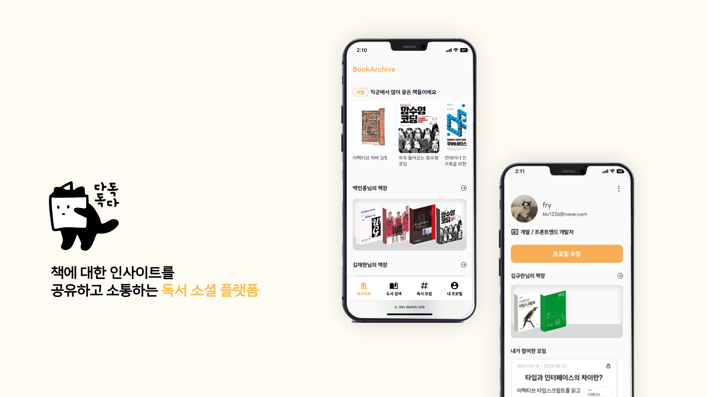
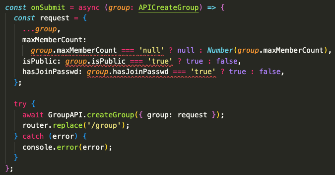
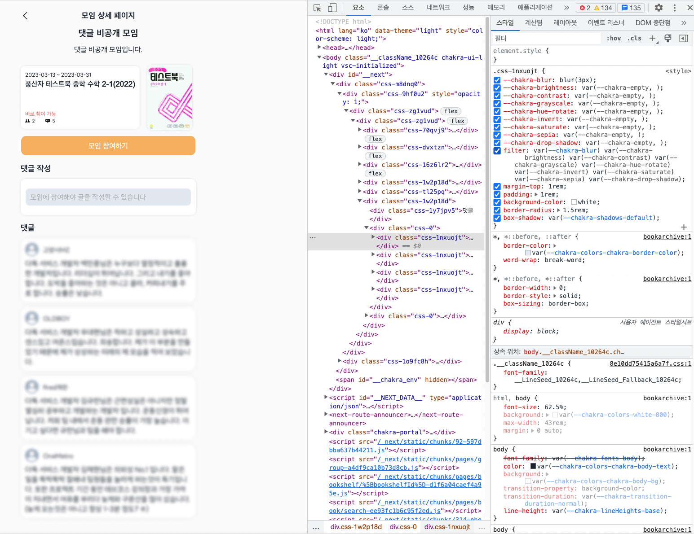
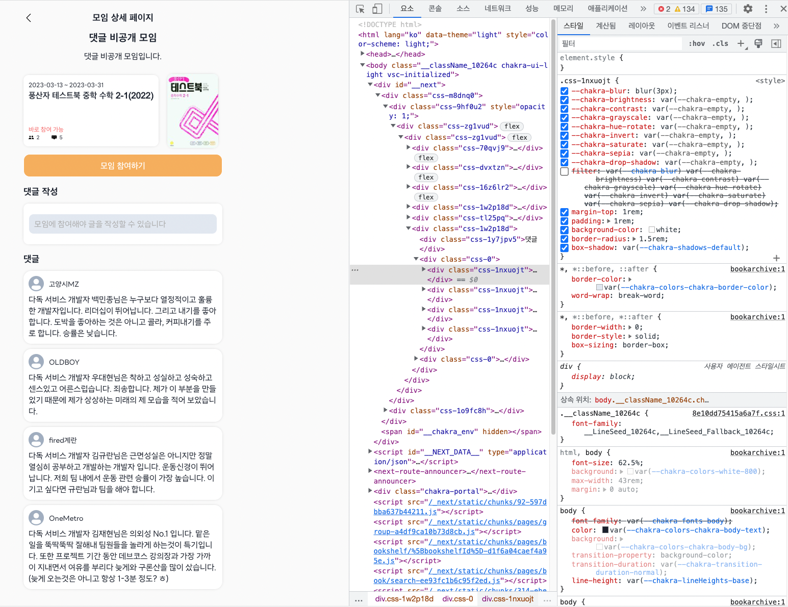

<div align="center">
  
  <br/>
  <h6><a href="https://dev.dadok.site">⭐️다독다독 서비스 바로가기</a></h6>
  <br/>
  <h6><a href="https://github.com/WooDaeHyun/Team-Gaerval-Dadok-FE">⭐️다독다독 Github Repo 바로가기</a></h6>
</div>

---

> #### 다독다독 서비스 소개

- 서비스 대상
  1. 책을 **추천** 받고 싶은 사람, 책을 **기록**하고 싶은 사람, 책에 대한 **이야기**를 나누고 싶은 사람
  2. **_개발자 벨로퍼트의 책장에는 어떤 책들이 꽂혀있을까?_**<br/>
     🤔다른 사람의 책장이 궁금한 사람
  3. **_요즘 재태크에 관심이 생겼는데 재태크에 관심이 많은 사람들은 요즘 어떤 책을 볼까?_**<br/>
     🤩특정 분야에 대한 책을 추천받고 싶은 사람
  4. **_리팩터링 2판 책을 완독하고 싶은데 다른 사람들과 생각을 공유하며 같이 읽고 싶다!_**<br/>
     🐥다른 사람들과 함께 독서를 하고 싶은 사람

---

> #### 핵심 기능 소개

- **책장 관리**(네이밍: **북카이브**)
  - 내 책장에 도서 저장, 내 도서에 코멘트 기록
  - 다른 사람의 책장 보기, 다른 사람이 남긴 책에 대한 코멘트 보기
- **온라인 독서 모임 모집**
  - 모임 전용 페이지 제공
  - 독서 기록 기능 제공
- **책 추천**
  - 개인 프로필에 따른 직군별 인기 책 추천
- **도서 검색**
  - 책에 관련된 정보와 책에 대한 사람들의 코멘트를 확인
  - 해당 책을 책장에 꽂은 유저들을 확인

<div align="center">
  
  <br/>
  <br/>
  
<div>

---

> #### 폴더 구조

<div align="center">
  <h6>Next.js 프레임워크를 사용했기 때문에 프레임워크의 폴더 구조를 기준으로 설계했다.</h6>
  <br/>
  <p>(Next.js 13버전이 나왔지만 우리 프로젝트에 맞지 않아 그 이전 버전을 기준으로 사용했다. 이와 관련된 내용은 아래에서 이야기해보려 한다.🤔)</p>
  <br/>
</div>

```
public
L icons
L images
src
L apis
L components
L constants
L hooks
L pages
L queries
L styles
L types
L ui
L utils
...
```

```
크게 1.UI 구성 코드 2.API 호출 코드 3.유틸 코드로 분리했다.

UI는 크게 페이지와 컴포넌트로 나눌 수 있으며,
페이지는 크게 메인, 책, 책장, 모임, 프로필 페이지로 구분되며,
도메인 별로 컴포넌트를 분류했다.

서버 상태 관리를 위하여 리액트 쿼리를 도입해 API 호출 코드는 순수 fetch 코드와 쿼리 코드로 분리했다.
각 API 호출 코드는 도메인 별로 분류했다.

그 밖에 커스텀 훅을 관리하는 hooks,
상수나 매직 넘버, 에러 코드를 위한 constants,
헬퍼 함수로 구성된 utils 디렉터리 등으로 구성했다.

```

&nbsp;&nbsp;`Next.js`의 경우 현재 주목 받고 있는 React 기반의 `프레임워크`이다. Next.js와 관련된 기초적인 지식은 프로젝트가 시작되기 전에 공부할 수 있었다. Next.js는 약간의 검색을 통해서도 많은 인기를 끌고 있으며 많은 기능들을 제공한다는 것을 알 수 있다. `code splitting`, `SSR`, `파일 기반 라우팅`, `경로 기반 pre-fetching`, `이미지 최적화`, `타입스크립트에 대한 기본 지원`... 등

<br/>

&nbsp;&nbsp;**Next.js**를 활용하여 프로젝트를 진행하면서 느낀 **장/단점**들이 있다.

1. **파일 기반 라우팅**<br/>
   &nbsp;&nbsp;기존에 라우팅을 위한 `Router`를 별도로 구현해야 했고, 하나 하나 컴포넌트들을 import해서 적용하고 경로 주소를 설정해주어야 했다. 작은 규모의 프로젝트에서는 큰 차이가 없겠지만 프로젝트 규모가 커지면 커질수록 `코드 작성 시간`, `에러 발생 확률` 측면에서 많은 **비용**을 아껴줄 것이라는 생각이 들었다.

2. **Dynamic Routes**<br/>
   &nbsp;&nbsp;URL에 변수를 넣는 방법으로 Next.js는 dynamic routes를 통해 기능을 제공한다. 처음에 사용할 때는 **편리하다**, **간단하다**라는 느낌을 받았었다. **_하지만_** 프로젝트를 진행함에 따라 `pages`내의 **폴더가 많아 지고** 폴더 구조의 **depth가 깊어질 수록** **헷갈린다**라는 느낌을 많이 받았다. 작은 규모의 팀 프로젝트를 진행함에도 헷갈린다는 느낌을 받았는데 규모가 더 커지게 된다면 분명 이해하는데 많은 시간이 소요될 것이다. 이 점은 오히려 React의 Router가 더 직관적인 부분이 아닌가 생각이 들었다.

3. **Redirect와 Rewrite**<br/>
   &nbsp;&nbsp;Next.js를 통틀어 아마 가장 편리한 기능 중 하나가 아닐까 생각이 들었다. `Redirect`와 `Rewrite`를 사용하면 들어오는 요청 경로를 다른 대상 경로에 매핑할 수 있다. 그리고 Rewrite는 유저가 URL의 변경여부를 알 수 없다. 이를 활용하여 **API를 숨길 수 있다.** 이 부분은 코드도 같이 확인해 보면 좋을 것 같다.

4. **Static Pre Rendering**<br/>
   &nbsp;&nbsp;이 기능은 정말 신기한 기능이라고 느꼈다. jsx에 들어있는 초기 상태의 코드들을 HTML 태그들로 pre-rendering 된다. 이를 통해 React의 큰 단점 중 하나인 `SEO`문제를 해결할 수 있다. 예전에 `SEO`와 관련된 내용을 찾아보며 알게 된 내용인데 **일반적으로 30%의 사용자들은 첫 번째 검색 결과를 클릭한다는 통계**를 보았다. 즉, 검색 엔진 최적화는 비용과 직결되는 문제다. 그렇기 때문에 프론트엔드 개발자들의 고민거리 중 하나였던 `SEO`문제를 해결할 수 있는 Next.js의 Static Pre Rendering은 엄청난 장점이 아닌가 하는 생각이 들었다.

```javascript
   /next.config.js;

  const API_KEY = process.env.API_KEY;

  const nextConfig = {
    reactStrictMode: true,
    async redirects() {
      return [
        {
          source: '/old-blog/:path', //출발지
          destination: '/new-sexy-blog/:path', //목적지
          permanent: false,
          // 영구적인지 아닌지에 따라서 브라우저나 검색엔진이 이 정보를 기억하는지 여부가 결정된다.
          // redirects는 user가 URL의 변경여부를 알 수 있다.
        },
      ];
    },
    async rewrites() {
      return [
        {
          source: '/api/movies',
          destination: `https://api.themoviedb.org/3/movie/popular?api_key=${API_KEY}`,
          // rewrites는 user가 URL의 변경여부를 알 수 없다.
        },
      ];
    },
  };

  module.exports = nextConfig;
```

&nbsp;&nbsp;이 정도가 내가 프로젝트를 진행하면서 직접 느낄 수 있었던 Next.js의 장점들이다. **13버전**의 `next/image`와 같은 새로운 기능이나, 성능측면에서 좋은 기능들이 많이 있겠지만 **프로젝트의 규모도 규모이고 공식문서를 통해 공부를 해 나가면서 적용해야 했기 때문에 바로 이해하고 "와~ 좋다!🤩" 하고 말한 것들은 이 정도인 것 같다. 그리고 한 가지 확실하게 느낀 점은 Next.js는 현 시장을 지배하고 있는 리액트처럼 프론트엔드 개발자라면 필수적으로 잘 다룰 수 있어야 되는 프레임워크라는 느낌이 들었다.**(아직..많이 부족하여 근거를 제시할 수는 없지만 이 그냥 촉이다..리액트, vercel, next.js...서로 뭔가 꿍짝이 잘 맞아 보인달까?)

---

> #### 개발 기간 (2023.2.10 ~ 2023.3.14) `리팩토링 별도 진행 중`

###### 1. 프로젝트 사전 기획(2023.02.10 ~ 2023.02.20)

&nbsp;&nbsp;이번 프로젝트는 백엔드 개발자분들과 함께 한 팀을 이뤄 진행하는 프로젝트였기 때문에 사전에 기획하는 과정이 굉장히 중요했다. 따라서 본격적인 작업에 앞서 기획에 많은 힘을 쏟았다. 1) **주제 선정** 2) **유저 스토리 정의** 3) **스프린트 결정** 4) **팀 문화 및 개발 관련 툴 선택을 했다.**

###### 2. 1차 스프린트(2023.02.20 ~ 2023.02.24)

&nbsp;&nbsp;본격적인 개발 작업을 시작했다. 1) **API 문서 합의** 2) **디자인 & 와이어프레임 완성** 3) **프로젝트 기본 환경 세팅**순으로 진행했다.

###### 2. 2차 스프린트(2023.02.25 ~ 2023.03.01)

&nbsp;&nbsp;기능을 분류하고 기능의 우선 순위를 `must`, `Should`, `could`로 분리하였고 2차 스프린트에서는 `must`로 분류된 기능들 구현 및 API 연결을 했다.(책장 관련 기능들)

###### 2. 3차 스프린트(2023.03.02 ~ 2023.03.06)

&nbsp;&nbsp;`Should`로 분리된 기능들 구현 및 API 연결을 했다.(모임 관련 기능들)

###### 2. 4차 스프린트(2023.03.06 ~ 2023.03.14)

&nbsp;&nbsp;`must`와 `should`들 중 기능 구현이 부족한 부분과 수정이 필요한 부분 리팩토링 및 문서화 작업

<div>
  <h6>프로젝트 계획을 세우면서 스프린트 기간을 짧게 짧게 가져갔는데 난 이점이 너무 좋았다.👍</h6>
</div>

&nbsp;&nbsp;스프린트 단위가 길어지게 되면 자칫 늘어지는 모습을 보일 수 있는데, 스프린트 단위를 짧게 짧게 가져가니 **목표가 뚜렷했고**, **뒤로 가면 갈수록 오히려 마음이 편안했다**. 다만 스프린트 기간을 짧게 세우기 위해서 **작업량을 스프린트 기간에 맞게 잘 분류하는것이 핵심이라고 볼 수 있겠다.**

---

> #### 나만의 프로젝트 목표🚀

&nbsp;&nbsp;지난 `언성히어로`프로젝트에서는 `완성도`를 개인적인 목표로 세웠었다면, 이번 프로젝트에서는 **코드 작성**측면에서 보다 발전하는 것을 목표로 세웠다. 어떤 프로젝트이든 **높은**`완성도`가 필요한 것은 당연한 것이다. 따라서 높은 완성도는 기본적으로 가져가야할 내용이고 더 나아가 **프론트엔드 개발자로서 한 층 발전**하는 것을 목표로 세웠다.

- <h6>코드의 가독성을 높이자</h6><br/>

  &nbsp;&nbsp;내가 생각하는 가장 좋은 코드는 **다른 개발자들이 코드를 보더라도 금방 이해하고 유지/보수 할 수 있는 코드를 작성**하는 것 이라고 생각한다. 왜냐하면 기술은 계속해서 발전해 나갈 것이고 그에 맞게 개발자들도 적용해 나가야할 것이다. **새로운 기술을 적용하는 방법**은 **새로운 프로젝트를 시작해서 적용**하는 방법과 **기존의 코드를 마이그레이션**하는 방법으로 나뉠 것이다. 그 중에서도 비교적 시간과 비용이 절약되는 **후자**가 많이 사용될텐데, 마이그레이션하는 과정에서 기존 코드를 작성한 개발자가 마이그레이션까지 담당하면 제일 좋겠지만 그렇지 못한 상황이 많을 것이고 이때 어떤 개발자든 코드를 보고 쉽게 이해할 수 있는 코드가 가장 시간과 비용을 절약해 줄 수 있는 **좋은 코드**라고 생각한다. 따라서 다음과 같은 목표를 가지고 프로젝트에 임했다.

  1. **중복된 코드를 줄이자!**<br/>
     &nbsp;&nbsp;코드의 가독성을 높일 수 있는 가장 좋은 방법은 **코드의 양을 줄이는 것**일 것이다. 그리고 필요한 코드를 제외한 **중복된 코드들을 줄이는 것**이 가장 좋은 방법 중 하나일 것이라고 생각한다. 그래서 나는 이번 프로젝트를 참여하면서 중복된 기능들을 최대한 **컴포넌트**로 만들기 위해 노력하면서 프로젝트에 참여했다. 예를 들면 **바텀시트**, **모달**처럼 여러곳에서 활용할 수 있는 기능들을 재사용할 수 있게 만들기 위해 노력하면서 참여했다.
  2. **적절한 CSS 코드들을 잘 활용해 보자!**
     &nbsp;&nbsp;`style`과 관련된 코드들을 정리하지 못하고 코드를 작성한 경우가 많았다. 예를들면 `div` 태그가 의미 없이 한 번 더 감싸고 있거나 `non-semantic` 태그들을 사용하는 경우가 많았다. **CSS 지식의 부족**이 가장 큰 원인이었지만, 그래도 **계속해서 공부하면서 발전하고 있다고 스스로 생각**한다. 따라서 이번 프로젝트에서는 적절한 `CSS`태그들을 활용하고 정돈된 `style`관련 코드를 작성하는 것을 목표로 세웠다. 우리 프로젝트에서는 `Chakra UI`를 활용하기 때문에 **라이브러리**에서 제공하는 스타일 컴포넌트들을 적재적소에 잘 활용하는 것을 목표로 했다. 우선 최대한 `Depth`가 깊어지지 않는 코드를 만들기 위해 노력했다. 또 예를들어 여러 박스들이 일정한 규칙에 따라 세로로 쌓인다면 `Flex` 컴포넌트 대신 `VStack`을 활용하고, 일정한 내용만을 전달하는 경우에는 `Box`컴포넌트 대신 `Text`컴포넌트를 활용하는 것과 같이 `semantic`하게 작성하려고 노력했다.

- <h6>새로운 기술들을 적극적으로 적용해 보자!</h6><br/>

  &nbsp;&nbsp;지난 프로젝트에서는 첫 프로젝트이고 **기능 구현을 하는 것만으로도 많은 부담을 느꼈던 것**이 사실이다. 하지만 이전 프로젝트를 통해 그런 두려움은 어느 정도 극복이 된 것 같았다. 따라서 이번 이번에는 우리 프로젝트에 필요한 **좋은 기술들**을 **적극적으로 적용해 보고 학습**하는데 목표를 두었다.

  1. `react-hook-form`**적용**<br/>
     &nbsp;&nbsp;데브코스에 참여하면서 많은 새로운 라이브러리들을 알게 되었는데, 그 중 하나가 바로 `react-hook-form`라이브러리 였다. 이전에 **사용자로 부터 데이터를 수집**하는 과정에서 `input`들을 통해 데이터를 받고 `state`를 통해 데이터를 관리하고(**제어 컴포넌트**) `validation rule`코드를 작성하고 `validation 검사`를 하는 코드들을 작성했어야 했다. 사용자로부터 수집해야 할 데이터가 많아지면 많은 문제점들을 야기할 수 있다. 대표적으로 **에러의 발생**이다. **많은 state로 관리 포인트**가 늘어나게 되면 그 만큼 실수가 발생할 확률도 높아진다. 또한 `setState`의 경우 기본적으로 **비동기적으로 동작하기 때문에 이로 인해 에러가 발생할 확률도 높아진다.** 또 `input`에 입력한 데이터 상태와 저장된 데이터의 상태가 항상 일치하기 때문에 불필요한 단어가 입력되더라도 값이 갱신된다. 이는 다시 말해 불필요한 리렌더링이 이뤄진다고 표현할 수도 있을 것이다.

     &nbsp;&nbsp;`react-hook-form` 라이브러리는 form의 `validation`검사를 빠르고 쉽게 도와주며 전체 폼이 리렌더링 되지 않는다. 또한 각각의 상태 변화를 관찰할 수 있기 때문에 성능면에서도 빠르며 의존성도 없다. 이러한 장점들을 공부하면서 알게 되었고 우리 `다독다독` 프로젝트의 **회원가입**, **모임생성** 기능에서 **많은 데이터를 사용자로부터 받게 되는데**, 이때 꼭 적용하면 좋은 라이브러리라는 생각이 들었다. 그래서 **적극적으로 적용**했다.

  2. `React-query`**적용**<br/>
     &nbsp;&nbsp;지금 내가 가장 익숙하지 않은(?) 내용이 바로 **서버 상태 관리**와 관련된 내용이다. 단순히 `axios`를 통해 요청을 보내고 필요에 따라서 데이터를 관리해 왔던 것이 전부다. 따라서 제대로 학습할 시간이 필요했다. 매일 개발과 관련된 정보들만 보게 되면서 `React-query`에 대해서 알게 되었고 서버 상태 관리를 하는데 매우 유용한 라이브러리라는 것을 알게 되었다. 그리고 이번 기회로 확실하게 공부할 필요가 있다고 느꼈다.
     <br/>
     <br/>
     &nbsp;&nbsp;`React-query`를 적용하기 위해 사전에 공부를 하면서 알게 된 사실은 기존의 Redux, Mobx, Recoil과 같은 다양한 상태 관리 라이브러리들이 있긴 하지만 클라이언트쪽의 데이터들을 관리하기에 적합할 순 있어도 **서버 쪽의 데이터들을 관리하기에는 적합하지 않은 점들이 있어** `React-query`가 만들어졌다고 알게 되었다. 그리고 **캐싱**, **같은 데이터에 대한 여러번의 요청이 있을 시 중복 제거** 등 **공식 문서**와 **여러 레퍼런스를** 통해서 기능들을 확인할 수 있었다(❌리액트 쿼리에 대해 100% 이해하고 전부 공부한 것은 아니지만 적어도 우리 프로젝트에 적용할 수준으로는 공부한 것 같다). 그리고 우리 `다독다독` 프로젝트에도 많은 API 요청이 예상되었기 때문에 적극적으로 적용했다.
     <br/>
     <br/>
     &nbsp;&nbsp;`React-query`를 적용하면서 가장 좋았던 점은 바로 `isSuccess`, `isLoading`과 같은 서버 관련 상태에 대한 정보를 제공해 준다는 점이었다. 기존 axios를 통해 상태 관리를 하기 위해서는 **isLoading** 상태를 직접 관리해야 했고, **isSuccess** 여부를 직접 확인해야 했다. 하지만 `React-query`에서는 **서버 관련 상태 데이터**를 제공해 주기 때문에 `Skeleton`적용과 같은 처리가 매우 용이했고, 코드의 양도 줄일 수 있었다.

     <h6><a href="https://github.com/ssi02014/react-query-tutorial">⭐️리액트 쿼리 Reference</a></h6>
     <h6><a href="https://tanstack.com/query/v3/docs/react/overview">⭐️리액트 쿼리 공식문서</a></h6>

---

> #### 내가 담당한 기능 및 구현 내용

##### 독서 모임 관련 페이지 구현

<div align="center">
  <h4>✨ 모임 리스트 페이지</h4>
</div>

<br/>

&nbsp;&nbsp;모임 리스트 페이지에서는 **비로그인 유저**, **로그인 유저** 모두에게 보여지는 페이지이다. 그리고 모임 리스트 페이지를 통해서 **책 상세 정보 페이지**, **모임 상세 정보 페이지**, **모임 생성 페이지(로그인한 유저)** 로 이동할 수 있다. **비로그인 유저가 모임 생성 버튼을 클릭한 경우에는 로그인 페이지로 이동하게 된다.** 이 페이지에서는 균형있게 모임에 대한 정보들을 배치하는 UI를 잘 구현하는 것이 가장 중요했다.

<div align="center">
  
</div>
<br/>

- **구현 내용**

  - 모임 리스트 UI 구현 및 Link 연결
  - **React-query-infinite-scroll 적용**

- **어려웠던 점**
  - React-query-infinite-scroll 적용<br/>
    프로젝트에서 무한스크롤 구현을 위해 `useInfiniteQuery`를 사용했는데, 그 적용 자체가 굉장히 어려웠다.

---

<div align="center">
  <h4>🐥 모임 생성 페이지</h4>
</div>

<br/>

&nbsp;&nbsp;모임 생성 페이지는 **로그인 한 유저**라면 누구든지 특정 책과 관련된 내용을 공유할 수 있는 모임을 생성할 수 있다. **비로그인 유저**가 모임 생성 버튼을 클릭한 경우 **로그인 바텀시트**가 나오게 된다.

<div align="center">
  
  <br/>
  <br/>
  <br/>
  
</div>
<br/>

- **구현 내용**

  - 모임 생성 Form UI 구현
  - 모임 생성 책 검색 UI 구현
  - `React-hook-form` **적용을 통한 데이터 관리 및 validation 검사**

- **구현 중 발생한 문제**
  - **react-hook-form을 통해 받은 defaultValues 객체의 데이터 타입**과 **모임 생성 API Request Body**에 들어가는 객체의 타입이 일치하지 않아 **⛔️Type Error** 발생<br/>

**모임 생성 API Body**에 들어가는 데이터 타입 정의는 다음과 같다.<br/>

```javascript
export interface APICreateGroup {
  bookId: number;
  title: string;
  startDate: string;
  endDate: string;
  maxMemberCount: number | null;
  introduce: string;
  hasJoinPasswd: boolean;
  joinQuestion: boolean;
  isPublic: boolean;
  joinPasswd: string;
}
```

&nbsp;&nbsp;하지만 form을 통해 들어오는 데이터는 전부 `string type`으로 들어온다. 여기서부터 문제가 시작되었다. react-hook-form의 `useForm().defaultValues`의 `hasJoinPasswd`, `inPublic`, `maxMemberCount`가 전부 `string type`의 **값**으로 들어가게 되고, API 호출을 위해서는 각 데이터를 **APICreateGroup**의 타입에 맞게 변환해 주어야 했다. 이 과정에서 react-hook-form의 `useForm().handleSubmit()`에 전달되는 `register`에 등록된 데이터 즉 여기서는 **defaultValues가 가리키는 객체**의 타입 정의를 어떻게 해줘야 하는지에 대한 문제였다. (모든 타입은 /types에서 정의했다.)


<br/>

&nbsp;&nbsp;당연하게도 **onSubmit의 group**(`useForm().handleSubmit()`호출시에 전달되는 `register`에 등록된 데이터들의 객체)**의 type을 APICreateGroup**으로 사용하면 type error가 발생했다. 또한 **defaultValues 객체가 가지고 있는 값들에 따라 UI가 변경되어야 했기 때문에 APICreateGroup**을 지금 상태로 사용할 수 없다는 것은 확실해졌다. 이를 해결하기 위한 방법을 고민하기 시작했다. 왜냐하면 **defaultValues 객체를 위한 또 다른 중복된 타입 선언 만큼은 꼭 피하고 싶었기 때문이다.😵‍💫** 그 과정에서 별의 별 생각을 다 한 것 같다.

1. **백엔드 팀원들에게 객체의 각 데이터를 전부 string으로 받아 백엔드에서 변환하여 처리하면 안되겠냐고 부탁할까?**<br/>
   &nbsp;&nbsp;지금 다시 생각해도..말 같지도 않은 생각인 것 같다. 데이터는 해당 데이터 속성(?)에 알맞은 데이터 타입을 갖는게 더 맞는 것 같았다. **예를들어 isPublic은 누가 보더라도 `boolean type`의 값을 가질 것이라고 생각할 것 같고, 잘은 모르겠지만 데이터베이스에도 `boolean type`의 값으로 저장되는게 맞을 것 같았다.** 그리고 욕도 먹을것 같았다...😅
   <br/><br/>
2. **변환이 필요한 값들을 애초에 number와 boolean으로 defaultValues객체에 넣을 수는 없을까?**<br/>
   &nbsp;&nbsp;이 방법이 가장 이상적인 방법이라고 생각했다. 그래서 **긴 시간의 구글링과 조언을 구할 수 있는 주변 동료들에게 폭풍 질문을**했다. 결론은 원하는 답을 찾지 못했다.😥 이걸 보고 너무 불편하다는 생각이 들었다. 만약 정답이 있지만 내가 정답을 찾지 못한 것이라면 나의 무지에서 비롯된 해프닝이겠지만, 반대로 **input**을 통해 들어오는 데이터는 전부 `string type`으로 받는다면 **input**의 **type속성**은 왜 필요한 것인지 의문이 들었다.🤔 예를들어 `<input type="number">`는 UI에서 문자 타이핑을 막아주는 역할만을 위해 존재하는 것인지 말이다.
   <br/><br/>
3. **모임 생성 폼을 담당하는 컴포넌트에서 해당 부분만 타입을 다시 정의해야 겠다는 결론에 도달했다.**<br/>
   &nbsp;&nbsp;1번 방법과 2번 방법 둘 다 불가능하다는 판단을 했고 그렇다면 코드의 중복을 최소화하는 방법으로 모임 생성 폼을 담당하는 컴포넌트 내부에서 변환이 필요한 부분만 타입을 다시 정의해서 해결해야 겠다는 결론을 내렸다. 그래서 **Omit**으로 `hasJoinPasswd`, `inPublic`, `maxMemberCount`의 타입만 다시 변경해서 타입 정의(**FormValues**)를 다시하고 적용하여 해결했다.

     <br/>

   ```typescript
   interface FormValues
     extends Omit<APICreateGroup, 'maxMemberCount' | 'hasJoinPasswd' | 'isPublic'> {
     maxMemberCount: number | string | null;
     hasJoinPasswd: 'true' | 'false' | boolean;
     isPublic: 'true' | 'false' | boolean;
   }
   ```

   ```typescript
   const methods = useForm<FormValues>({
     mode: 'all',
     defaultValues: {
       bookId: 0,
       title: '',
       introduce: '',
       maxMemberCount: '100',
       startDate,
       endDate: '',
       hasJoinPasswd: 'false',
       joinQuestion: '',
       joinPasswd: '',
       isPublic: 'true',
     },
   });
   ```

   ```typescript
   const onSubmit = async (group: FormValues) => {
     const request = {
       ...group,
       maxMemberCount: group.maxMemberCount === 'null' ? null : Number(group.maxMemberCount),
       isPublic: group.isPublic === 'true' ? true : false,
       hasJoinPasswd: group.hasJoinPasswd === 'true' ? true : false,
     };

     try {
       await GroupAPI.createGroup({ group: request });
       router.replace('/group');
     } catch (error) {
       console.error(error);
     }
   };
   ```

---

<div align="center">
  <h4>🐱 모임 상세 페이지</h4>
</div>

<br/>

&nbsp;&nbsp;모임 상세 페이지의 경우 **정책적으로** 복잡했다. **로그인한 유저**와 **비로그인 유저** 그리고 **모임에 참여중인 유저**와 **모임에 참여하고 있지 않은 유저**를 **모임 생성시 설정한 모임의 성질**에 따라 <u>별도의 UI를 구현</u>해야 했다. 조건들은 다음과 같다.

- **로그인 하지 않은 사용자**
  1. **공개모임**으로 설정된 모임인 경우: 코멘트 전체 노출
  2. **비공개모임**으로 설정된 모임인 경우: 코멘트 노출 ❌ (**blur처리**)
- **로그인한 사용자**
  - **모임에 가입하지 않은 사용자**
    1. **공개모임**으로 설정된 모임인 경우: 코멘트 전체 노출
    2. **비공개모임**으로 설정된 모임인 경우: 코멘트 노출 ❌ (**blur처리**)
  - **모임에 가입한 사용자**
    1. 모임공개, 비공개여부와 관계 없이 모든 코멘트 노출

<div align="center">
  
  <br/>
  <br/>
  <br/>
  
</div>
<br/>

- **구현 내용**

  - 모임 생성 조건에 따른 모임 상세 페이지 UI 및 CRUD 구현
  - 댓글 CRUD 구현
  - 가입 비밀번호가 필요한 모임의 경우 비밀번호 입력 폼 구현
  - **코멘트 노출 ❌인 UI를 보여줘야 하는 경우 댓글 최대 4개 노출 및 blur 처리**

- **구현 중 발생한 문제**<br/>
  &nbsp;&nbsp;모임의 **코멘트 노출 ❌인 UI를 보여줘야 하는 경우** 댓글들을 **blur**처리 하는 방식으로 기획을 했다. 처음에는 단순하게 css 속성으로 blur 처리를 하면 된다고 생각했는데 <h4>문제는 개발자 도구를 통해서 blur 처리를 지우면 내용들을 다 볼 수 있다는 것이었다.😳</h4> 이를 해결하기 위한 방법으로는 **2가지 방법**이 떠올랐다.
  <br/>
  <br/>

  1. 🚫 **blur 처리 없이 아예 댓글 리스트를 노출시키지 않는 방법**<br/>
     &nbsp;&nbsp;어찌보면 가장 간단하면서 나의 입장에서 쉬운 방법이다. 하지만 **기획 의도는 댓글들이 존재한다는 사실을 알려줌과 동시에 해당 댓글들을 보기 위해 가입을 유도하는 목적**으로 댓글들을 **blur처리하여 노출시켜주는 방식**을 택한 것이기 때문에 **기획 의도 맞지 않았고 UX적으로도 사용자에게 좋은 경험을 만들어 줄 수는 없을 것**이라고 판단했다.

  <br/>

  2. ✅ **코멘트 노출 ❌인 UI를 보여줘야 하는 경우 노출시켜 줄 데이터를 만들어 댓글 개수에 맞게 최대 4개를 노출시켜주는 방법**<br/>
     &nbsp;&nbsp;코멘트 노출 ❌인 UI를 보여줘야 하는 경우에는 미리 개발자에 의해서 만들어 놓은 데이터를 현재 댓글 개수에 맞게 최대 4개까지 노출시켜주는 방법이다. 예를들어 **모임의 댓글 개수가 현재 2개인 경우 임의로 만들어 놓은 댓글 2개를 blur처리 하여 노출시켜주는 방법이다.** 이 방법을 통해서 기획의 의도대로 구현할 수 있었고 또 개발자 도구를 통해서 blur 처리를 지우더라도 댓글 내용들을 볼 수 없기 때문에 이 방법을 택했다. 그리고 만들어 놓은 댓글들의 내용은 우리 프로젝트의 **🥚이스터에그🥚**로 만들기로 했다.

  <div align="center">
    
    <br/>
    
  </div>

---

> #### 리팩토링(2023.03.29 ~ 현재 진행 중)

###### 모임 관련 리팩토링 진행 예정 및 진행 한 상황

1. 중복 코드 제거
2. ~~UI 통일(댓글 수정,삭제 햄버거 메뉴로 변경)~~ **✅완료**
3. 모임 검색(API 완성시)
4. 유저가 직접 설정 가능한 모임 생성 인원 제한 옵션 추가
5. 최근 검색어 기능 추가

---

<div align="center">
  <h3>🐶프로젝트를 마무리 하며🐶</h3>
  <br/>
  <p>&nbsp;&nbsp;이번 프로젝트는 정말 많은 것을 배울 수 있었던 프로젝트였다. <strong>현재 계속해서 <u>리팩토링도 별도로 진행</u>하고 있지만</strong>그 외에도 많은 것을 학습할 수 있었다. 우선 <strong>코드를 간결하고 깔끔하게 작성하는 연습</strong>을 할 수 있는 시간이었고, <strong>여러 기술들을 적용해보고 또 적용하는 과정을 익힐 수 있는 시간</strong>이었다. 그리고 이러한 것들을 연습할 수 있도록 도와준 사람들이 바로 <strong>팀원들</strong>이다. 특히, 팀원들의 <strong>코드리뷰</strong>가 정말 많은 도움이 되었다. 우리 팀 분위기 중 가장 좋았던 부분이기도 하다. 프로젝트 마감일이 다가올수록 코드리뷰가 조금은 느슨해 질 수 있는데, <strong>우리 팀은 끝까지 정성스럽게 코드리뷰를 해주었다.</strong> 이러한 문화를 바탕으로 정말 많은 공부를 할 수 있었다. 또 이와 별개로 정말 분위기 좋은 팀 분위기가 이어져 하루 하루 재미있게 웃으면서 프로젝트에 임했던 시간이었다. 오프라인으로 자주 만나 대화도 많이 했고, 또 운동도 많이 즐기면서 프로젝트에 참가했다. <strong>아마 데브코스에 참여하면서 가장 많이 웃었던 시간이 아닐까 생각한다. </strong>행복한 추억을 만들어준 <strong>우리 팀원들에게 정말 고맙다는 말을 전하고 싶다.</strong>☺️</p>
</div>
