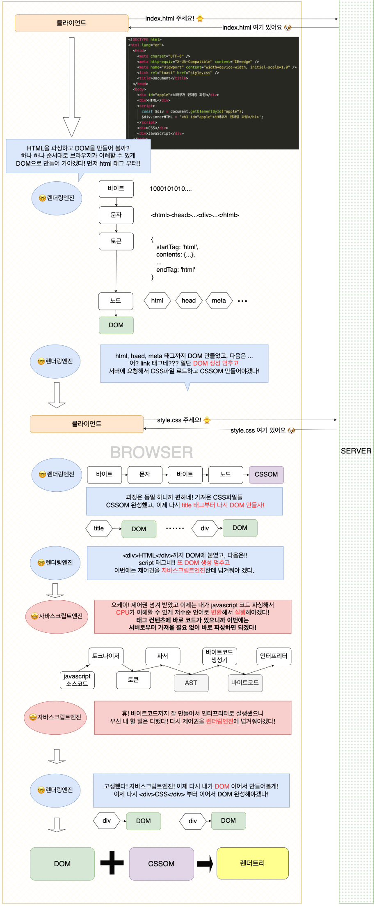

&nbsp;&nbsp;지금까지 공부를 하면서 많은 것들에 매번 새롭게 듣게 된다. `트랜스파일러`, `컴파일러`, `인터프리터`, `번들러`, `SPA`, `MPA`, `CSR`, `SSR` 등 많은 것들을 듣게 되고 어떤 역할을 하게 되는지 어렴풋하게 알게 된다. 하지만 중요한 것은 **왜 그게 필요한데?** 라는 질문에 지금의 나는 정확하게 대답하지 못할 것이다. 공부를 하면 할수록 모든 것들의 존재 이유가 명확하게 있었다. 특정 부분에 문제가 있어 이를 해결하기 위한 수단으로 등장하거나 기존에 불편함을 해소하기 위해 등장하는 등 **존재 이유가 없는 CS는 없었다.** 그리고 적어도 프론트엔드와 관련된 전체적인 동작 방식을 정확하게 이해하고 있어야만 앞으로의 개발 공부를 깊이 있게 이어나갈 수 있을 것이라는 생각이 들었다. 따라서 오늘은 가장 기초가 되는 **브라우저 렌더링 과정**에 대해서 공부를 했고, **이를 한 눈에 볼 수 있게 요약해 보면 좋겠다는 생각이 들어 일련의 과정을 그려보려 한다.**

---

> #### 브라우저 렌더링 과정

 

&nbsp;&nbsp;나름대로 열심히 한 눈에 보게 만들어 보겠다고 만들어 보았는데 너무 B급 감성인가 싶다.😅 일단 내용을 일목요연하게 다 넣어보고 싶었으나 그럼 너무 길이만 길어질 것 같아서 **핵심이 되는 이야기만 간추려 보았다.**

---

> #### 존재에는 다 이유가 있다

&nbsp;&nbsp;브라우저 렌더링 과정을 좀 더 천천히 깊이있게 공부해보면서 이전 보다는 확실히 이해도가 올라갔다고 스스로 느낄 수 있었다. 그리고 **내가 확실하게 알고 있어야 할 내용이 무엇인지 생각해 봤다.**

### 바로 HTML, CSS, JavaScript의 파싱 목적이 무엇인가? 이다.

 

###### - HTML, CSS 파싱 목적은?

 

&nbsp;&nbsp;결론부터 말하면 **브라우저가 이해할 수 있는 자료구조인 DOM을 만드는 것이다.** HTML 문서는 문자열로 이루어진 순수한 텍스트다. 따라서 **순수한 텍스트**인 HTML 문서를 브라우저에 시각적인 픽셀로 렌더링하려면 HTML 문서를 브라우저가 이해할 수 있는 자료구조로 변환하여 메모리에 저장해야 한다. 그렇기 때문에 파싱하는 것이다! **CSS도 마찬가지다.**

###### - JavaScript의 파싱 목적은?

 

&nbsp;&nbsp;**CPU가 이해할 수 있는 저수준 언어로 변환하고 실행하기 위해서다.** 단순한 문자열인 자바스크립트 소스코드를 파싱하는 과정을 거쳐 CPU가 이를 실행한다. 따라서 CPU가 이해할 수 있는 기계어로 바뀌는 과정이 필요한 것이다. **여기서 reference마다 약간의 설명하는데 차이가 존재한다. 마지막 AST를 바이트코드로 변환하는 역할을 하는것이 인터프리터로 설명하는 곳이 있고, 별도의 바이트코드 생성기에 의해서 바이트코드로 변환이 된 후에 인터프리터에 의해서 실행이 된다고 설명하는 것도 있었다.** 여러 자료들을 찾아보았는데 각자 설명하는것이 달라 우선 결론을 정확하게 인지하기로 생각했다.

&nbsp;&nbsp;결론적으로 **CPU가 이해할 수 있는 기계어**로 변환이 되어야 하는 것은 사실이고 CPU마다 기계어를 다르게 해석하기 때문에 CPU 별로 최적화된 기계어를 만들어 내야 한다는 것이다.

&nbsp;&nbsp;이러한 이유에서 **렌더링 엔진과 자바스크립트 엔진이 별도로 만들어져 있는 이유도 설명할 수 있을 것 같다.** 서로 파싱하는 과정과 목적이 명확하게 다르기 때문에 별도로 구현되어 있는게 아닐까 생각한다.

###### 결국 파싱하는 목적은 브라우저와 CPU가 이해할 수 있게 만들어주는 과정이었던 것이다.

---

&nbsp;&nbsp;그리고 이렇게 만들어진 **DOM, CSSOM이 결합**하여 브라우저는 **레이아웃**과 **페인팅** 작업을 하게되고 우리가 보는 웹 페이지가 나오게 되는 것이다.

&nbsp;&nbsp;이번에 브라우저 렌더링 과정을 공부하면서 확실히 이해도가 올라간 것을 느낄 수 있었다. 예를들어 이전에는 **리렌더링**이 발생했을 때 정확하게 어떤 방식으로 브라우저가 동작하는지 정확하게 몰랐다. 대략적으로 렌더링되는 과정만 알았을 뿐 큰 흐름을 제대로 이해하고 있지 못한 증거였다. 뭔가 데이터가 바뀌면서 다시 그리는 것이라고 두루뭉실하게 넘어간 것도 사실이다. **하지만 이제는 정확하게 설명할 수 있다.** **DOM API를 조작**하거나 **Layout이 변경**될 수 있는 CSS의 수정이 생기면 만들어진 **DOM**, **CSSOM**이 **변경**되고 **다시 렌더 트리로 결합**되면서 **리플로우**와 **리페인트**가 이뤄지는 것이었다.(참고로 레이아웃 변경이 없으면 리플로우는 일어나지 않는다.)

&nbsp;&nbsp;또 트랜스파일러의 경우에는 JavaScript 소스코드가 파싱되면서 생성되는 AST를 사용하여 구현할 수 있다는 내용을 알게 되었다.**TypeScript**와 **Prettier** 같은 트랜스파일러를 AST로 구현하는 이유는 바이트코드로 변환되기 전이면서, 문법적 의미와 구조를 갖고 있는 상태이기 때문에 그런것이 아닌가 하는 생각이 들었다. (~~이 부분은 온전한 나의 생각이라 틀릴 수 있다.~~)

&nbsp;&nbsp;그래도 뭔가 애매하게 알고 있어 찝찝한 이 기분이 어느정도 해소된 기분이라 기분이 좋다! ☺️

###### 그치만 또 까먹을까 두렵다! 복습만이 살길이다! 🔥
