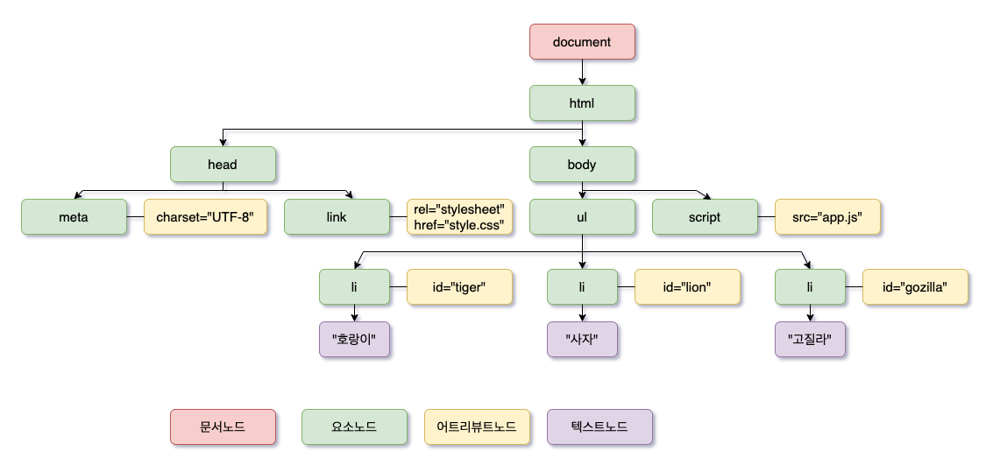
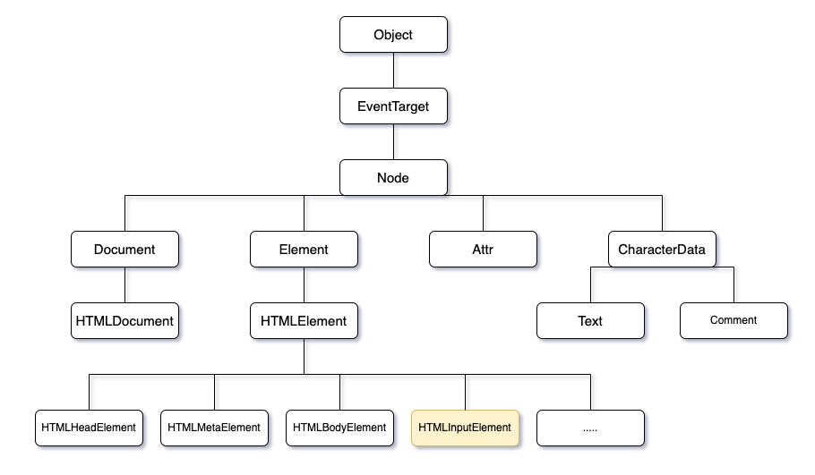
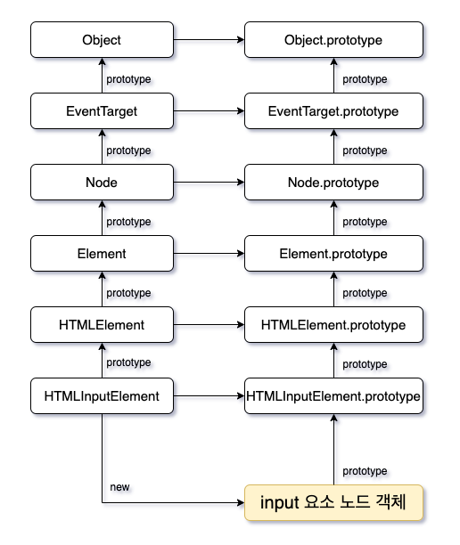

&nbsp;&nbsp;브라우저 렌더링 과정을 통해서 어떤 방식으로 **브라우저가 페이지를 페인팅 하는지 알 수 있었다.** 그리고 그 과정에서 HTML을 `파싱`하며 DOM을 생성하게 된다. 프론트엔드 개발자라면 당연하게도 알고 있어야 하는 `DOM`과 관련된 내용에 대해서 다시 한 번 살펴보고 어떤 원리로 `DOM`을 조작하는지 정리해보고자 한다. 우선 `DOM`이란 무엇인지에 대해서 살펴보자!

> #### DOM 이란?

&nbsp;&nbsp;`DOM`은 **HTML 문서의 계층적 구조와 정보를 표현하며 이를 제어할 수 있는 API, 즉 DOM을 조작할 수 있는 프로퍼티와 메서드를 제공하는 트리 자료구조다.** 우리가 서버로 부터 받아오는 HTML문서 자체는 `이진수`로 이루어진 문자열 그 이상도 이하도 아니다. 그렇기 때문에 브라우저는 HTML문서의 `요소`들을 **렌더링 엔진**을 통해 브라우저 자신이 이해할 수 있는 `노드`객체들로 변환하고 이 `노드`객체들을 토대로 트리 자료구조를 만들고 이를 활용하여 렌더링도 하고 조작할 수 있는 기능을 제공하는 것이다.

(반대로 생각하면 브라우저가 존재하기 때문에 *프론트엔드 개발자*가 존재할 수 있다고 생각해도 과언은 아닐 것이다. 만약 브라우저의 렌더링 엔진이 수행해주는 기능들을 직접 구현해야 한다고 생각해보면.. 아마 개발자라는 직업의 진입장벽(?)은 꽤나 높지 않을까 싶다. ~~물론 개발자의 진입장벽이 낮고 아무나 할 수 있다고 생각하는 것은 아니다. 😭 공부를 하면 할 수록 어려운 직업임은 틀림없다.~~)

&nbsp;&nbsp;그렇다면 **HTML의 요소들이 중간 처리과정을 거쳐 노드 객체가 된다**는 말인데, 어떤 방식으로 `요소`들을 `노드`들로 변환하는지 알아두면 좋을 것 같다. 이걸 공부하기 앞서 정확한 이름들을 알아 둘 필요가 있다. **개발을 하면서 많은 개발자들이 조금은 편하게 용어를 칭하는 경우가 많은데, 사실 난 그런 습관을 좋게 보지는 않는다.** 정확한 명칭과 용어는 **개발자들간의 소통 과정에서 많은 비용을 줄일 수 있고 전문직인 개발직군을 보다 더 전문가로 만들 수 있다고 생각한다.** 물론 모든 문서들이 영어로 되어 있어 해석 방법이 제각각이라는 문제점이 존재한다는 것을 모르는 바는 아니나 언젠가는 이를 명확하게 정리할 필요는 있다고 생각한다. 우선 DOM을 잘 이해하기 위해 용어 정리부터 다시 해보면서 차근차근 내용을 살펴보자.(이미 내 블로그를 보는 사람이면 다 전부 알고 있겠지만 그래도 명칭을 정확하게 한 번 다시 짚어보자!)

```HTML
<div class="woodaelog">도도도도돔</div>

시작태그: <div>
종료태그: </div>
어트리뷰트 이름: class
어트리뷰트 값: woodaelog
컨텐츠: 도도도도돔
```

&nbsp;&nbsp;위의 코드블록과 같이 하나의 HTML 요소에는 많은 개념들이 존재하고, 각 개념들마다 존재 이유가 명확하다. 그렇다면 이러한 내용들을 모두 반영한 DOM을 만들어야 할텐데 브라우저는 어떻게 만들까? **방법은 간단하다.** 각 개념들에 알맞는 `노드`를 생성하는 것이다. 우선 위의 코드를 기준으로 `div` HTML 요소는 `요소 노드`, `class="woodaelog"` 어트리뷰트의 이름과 값은 `어트리뷰트 노드` 그리고 `도도도도돔` 컨텐츠는 `텍스트 노드`로 만든다. 이러한 방식으로 HTML 요소들을 노드로 변환한다. 그리고 중첩 관계를 포함한 노드들의 집합이 **DOM**이다.

```javascript
(요소노드)   div --- class="woodaelog" (어트리뷰트노드)
            |
(텍스트노드) 도도도도돔
```

&nbsp;&nbsp;모든 개발자들이 당연히 아는 내용이지만 **시작태그와 종료태그 사이에는 HTML의 요소들이 들어갈 수 있다.** 이를 통해 HTML은 요소 간에 **계층적인 부자 관계**가 형성된다. DOM도 마찬가지이다. 즉 요소 노드의 컨텐츠 영역에는 다른 노드가 존재할 수 있고 또 다른 노드가 존재할 수 있다. 그리고 이러한 노드들은 **부자 관계**를 갖게된다. 그리고 이러한 **노드들의 집합을 DOM**이라고 부르는 것이다. 그럼 조금 더 전형적인(?) HTML 문서를 살펴보자!

```HTML
<!DOCTYPE html>
<html>
  <head>
    <meta charset="UTF-8">
    <link rel="stylesheet" href="style.css">
  </head>
  <body>
    <ul>
      <li id="tiger">호랑이</li>
      <li id="lion">사자</li>
      <li id="gozilla">고질라</li>
    </ul>
    <script src="app.js" type="module"><script>
  </body>
</html>
```

위의 HTML 문서를 파싱하여 `DOM`을 만들어 본다면??


<br/>

&nbsp;&nbsp;위의 그럼과 같이 `DOM`이 생성될 것이다. 쉽게 생각해 보면 간단하다. 문서의 내용대로 요소들이 객체로 변환된 것이라고 보면 된다라고 나는 생각한다. 위의 그림을 다시 보면 **`4가지` 종류의 노드들**이 있다. 그렇다면 노드의 종류는 총 4가지인 것일까? 결론부터 말하자면 아니다 **노드는 `총 12개`의 종류가 있다.** 그리고 이 중에서 꼭 알고 있어야하는 4가지 종류를 그린 것이다. 이 네 가지 노드들은 어떤 노드인지 그 특징을 알아두면 도움이 될 것이다.

---

> #### 노드 객체 타입

###### 1. 문서 노드(document node)

<br/>

&nbsp;&nbsp;**문서 노드는 DOM 트리 최상위에 존재하는 `루트 노드`로서 document 객체를 가리킨다. 그렇기 때문에 DOM의 노드들에 접근하기 위한 진입점 역할을 담당한다. document 객체는 브라우저가 렌더링한 HTML 문서 전체를 가리키는 객체로서 전역 객체 window의 document 프로퍼티에 바인딩되어 있다.** 자바스크립트 코드가 script 태그에 의해 분리되어 있더라도 하나의 전역 객체 window를 공유하기 때문에 모든 자바스크립트 코드는 전역 객체 window의 document 프로퍼티에 바인딩되어 있는 단 하나의 document 객체를 바라본다. 쉽게 말해 **HTML 문서당 document 객체는 유일하다!**

###### 2. 요소 노드(element node)

<br/>

&nbsp;&nbsp;**요소 노드는 HTML의 요소를 가리키는 객체다.** 요소들의 부자 관계를 통해 정보를 구조화한다. 따라서 요소 노드는 문서의 **구조**를 표현하는 특징을 가지고 있다.

###### 3. 어트리뷰트 노드(attribute node)

<br/>

&nbsp;&nbsp;**어트리뷰트 노드는 HTML 요소의 어트리뷰트를 가리키는 객체다.** 한 가지 특징은 요소 노드의 경우 부모 노드와 연결되어 있지만 어트리뷰트 노드는 부모노드가 없고 요소 노드와 연결되어 있다. 즉 어트리뷰트 노드는 부모드가 없기 때문에 요소 노드의 형제 노드는 아니다. 따라서 어트리뷰트 노드에 접근하기 위해서는 부모노드가 없기 때문에 **연결되어 있는 요소 노드로 부터 접근해야 한다.**

###### 4. 텍스트 노드(text node)

<br/>

&nbsp;&nbsp;**텍스트 노드는 HTML 요소의 텍스트(컨텐츠)를 가리키는 객체다.** **요소 노드**가 문서의 `구조`를 표현한다면 **텍스트 노드**는 문서의 `정보`를 표현한다. 텍스트 노드는 요소 노드의 자식 노드이며 자식 노드를 가질 수 없는 **리프 노드**라는 특징이 있다. 즉 **DOM의 최종단**에 위치한다.

&nbsp;&nbsp;가장 중요한 노드들의 특징들에 대해서 알아보았는데 위 4가지 이외에도 8개의 노드 종류가 더 있다는 사실을 알고 있으면 될 것 같다. 여기까지 공부했다면 한 가지 의문이 들것이다. 코딩을 하면서 `addEventListener`와 같은 메서드들을 통해서 이벤트 핸들러를 등록해 본 경험이 있다. **그렇다면 이러한 메서드들은 어디서 가져오는 것일까?**

물론 노드 객체는 `ECMAScript` 사양에 정의된 **표준 빌트인 객체**는 아니고 브라우저에서 추가적으로 제공하는 **호스트 객체**다. 하지만 **노드 객체도 자바스크립트 객체이기 때문에 프로토타입에 의한 상속 구조를 갖는다.** 그렇다면 노드들이 어떤 상속구조를 갖는지 한 번 살펴보면 좋겠다.

---

> #### 노드 객체의 상속 구조

&nbsp;&nbsp;자바스크립트는 프로토타입을 통한 상속구조를 갖는다. 그렇다면 노드도 객체이기 때문에 결국 프로토타입을 통해서 상속을 받게 될 텐데 어떤 객체로부터 상속을 받는지 스-윽😉 한 번 보면 좋을 것 같다.



<br/>

&nbsp;&nbsp;노드들은 위의 그림과 같은 **상속 구조**를 갖는다. 지금까지 우리는 `head`, `body`, `script`, `ul`, `li` 등의 HTML 태그들을 기반으로 만들어진 노드들에 대해서만 눈으로 봤지만 실제로는 뒤에 많은 객체들의 프로토타입 프로퍼티가 가리키는 프로토타입 객체에 의해서 상속을 받고 있다. 그렇기 때문에 우리는 `addEventListner`와 같은 메서드들을 활용하여 이벤트를 등록할 수 있는 것이다.

&nbsp;&nbsp;**즉, `EventTarget.prototype.addEventListner` 메서드를 모든 노드들이 상속받아 이벤트 핸들러를 등록할 수 있는 것이다.** 더 자세하게 `input`태그를 예로 들어 살펴보자. HTML의 **input 요소**는 렌더링 엔진에 의해 파싱되어 **input 요소 노드**로 변환 될 것이다. 그리고 다음과 같은 프로토타입 체인을 통해서 각종 프로퍼티와 메서드들을 사용할 수 있게 된다.



<br/>

&nbsp;&nbsp;`input`요소 노드는 위의 그림 처럼 프로토타입 체인상에 존재하는 많은 객체들에 의해서 프로퍼티와 메서드들을 상속받아 마치 자신의 것처럼 사용할 수 있게 된다. **그리고 정말 놀라운 사실은 공통된 기능일수록 프로토타입 체인의 상위에, 개별적인 고유 기능일수록 프로토타입 체인의 하위에 프로토타입 체인을 구축하여 노드 객체에 필요한 기능을 제공하는 상속구조를 갖는다는 것이다.**

&nbsp;&nbsp;나는 아직도 이러한 `추상화`를 보면 놀랍다. 정말 **체계적이라는 느낌을 많이 받았다.** (감탄이 나와 한 번 언급해 보았다..😅)

&nbsp;&nbsp;**무튼 우리 프론트엔드 개발자들은 이렇게 체계적으로 구조화된 프로토타입 체인을 통해서 `노드`를 조작하고 이를 통해 사용자들에게 좋은 경험을 심어줄 수게 되는 것이다.**

---

> #### 느낀점

&nbsp;&nbsp;솔직하게 코딩을 하면서 이러한 상속 구조를 정확하게 인지하지 못하고 있더라도 작업을 하는데는 큰 지장이 없다. 작업을 하면서 사용되는 프로퍼티와 메서드들은 한정적이고 **특정 프로퍼티나 메서드들을 어디서 상속받아서 사용하는지 알지 못하더라도 어떻게 동작하는지 알고 있다면 구현하는데는 큰 문제는 없기 때문이다.** 하지만 이러한 작은 지식들의 모음이 나중에는 큰 차이를 만들 것이라고 생각한다. 자동차를 운전할 줄 아는것과 자동차가 어떻게 동작하는지 알고 운전하는 다르다고 생각하기 때문이다. 그리고 이러한 차이는 특정 문제가 발생했을 때 진가를 발휘할 것이라고 믿는다.

&nbsp;&nbsp;그리고 우리 프론트엔드 개발자들은 앞으로도 계속해서 `DOM`을 조작하면서 작업을 해야한다. 따라서 DOM에 대해 정확히 알고 `DOM API`를 활용하는 자세가 필요하지 않을까 하고 생각한다.
