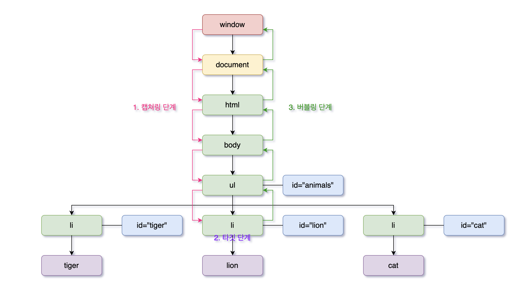

&nbsp;&nbsp;개발을 하면서 우리는 '여기에 이벤트 주면 될 듯?', '마우스 관련 이벤트 뭐가 있지?' 등 항상 이벤트 사용하게 된다. 그 이유는 사용자에 의한 특정 행위가 있을때 우리는 그 행위의 의도에 맞는 UI를 보여주어야 하기 때문이다. 하지만 **이벤트가 어떤 방식으로 동작하는지에 대해서는 정확하게 인지하지 못하고 사용하는 개발자들도 많이 있을 것이다.** 오늘은 이벤트가 어떻게 동작하는지에 대한 흐름을 이해하고 또 `이벤트 전파`나 `이벤트 위임`과 같은 주요 개념들에 대해서 다시 짚어 보려고 한다. 우선 이벤트가 무엇인지부터 살펴보자!

---

- 이벤트와 관련된 개념들의 **명칭**과 **의미**는 다음과 같다.

```javascript
<eventTarget> 이벤트를 발생시킨 DOM 요소
<currentTarget> 이벤트 핸들러가 바인딩된 DOM 요소
//eventTarget과 currentTarget이 동일한 경우가 일반적임
<eventHandler> 이벤트가 발생했을 때 호출될 함수
<eventHandler등록>: 이벤트가 발생했을 때 브라우저에게 이벤트 핸들러의 호출을 위임하는 것
```

---

> #### 이벤트는 어떻게 만들어지고 이벤트 핸들러는 어떻게 동작하는 것일까?

&nbsp;&nbsp;**브라우저는 특정 사건(ex 마우스 클릭, 키보드 입력 등)이 발생하면 이를 감지하여 `이벤트`를 발생 시킨다.** 즉, 브라우저가 특정 사건을 기반으로 의도적으로 발생시키는 것이 `이벤트`이다. 그리고 이러한 이벤트들의 종류를 문자열로 표현한것을 `이벤트 타입`이라고 한다. click, mousedown, submit. change... 등 이미 많은 이벤트 타입을 경험하고 이를 활용하고 있다.

&nbsp;&nbsp;그리고 개발자들은 일반적으로 **특정 이벤트가 발생**하면 **특정 함수가 동작**하도록 코드를 작성한다. 그렇다면 **한 가지 의문**이 생길 것이다. 특정 이벤트가 발생했을 때 특정 함수가 호출되도록 코드를 작성한다면 *특정 함수의 호출은 누가 해주는지*에 대한 의문이다. **왜냐하면 함수는 명시적으로 호출을 해주어야 하는데 개발자들은 언제 이벤트가 발생하는지 신이 아닌 이상 알 수 없기 때문이다.**

&nbsp;&nbsp;이 모든 것을 해결해 주는 것이 바로 `브라우저`의 역할이다. 다행스럽게도 `브라우저`는 특정 사건을 감지하여 **이벤트를 발생**시킬 수 있고 특정 이벤트가 발생하면 **특정 함수를 호출**할 수 있다. 우리 개발자들은 특정 함수를 호출할 수 있도록 브라우저에게 호출을 위임해 주는 것이다. 더 쉽게 말해 `브라우저`가 사건도 감지하고 이벤트도 발생 시키고 함수도 호출해 주기 때문에 **개발자들은 함수만 등록해주면 된다.** _이쯤되면 프론트엔드 개발자는 사실상 브라우저에 의존해서 살 수 밖에 없는 운명이 아닌가?_ 라는 생각도 잠시 들긴한다. 무튼 이벤트와 관련된 동작들은 대부분 `브라우저`에 의해 동작한다고 생각하면 될 것 같다.

&nbsp;&nbsp;이제 이벤트를 발생시키는 주체가 누구이고 또 특정 이벤트가 발생했을 때 이벤트 핸들러를 동작시키는 주체가 누구인지도 알게 되었다. 그리고 이러한 이벤트와 관련된 **특징**과 이러한 **특징을 활용**하여 코딩을 하는 방법들이 있는데 무엇이 있는지 다시 한 번 살펴보려고 한다. 그러기 위해선 우선 이벤트 핸들러를 등록하는 방법들에 대한 특징을 살펴봐야겠다.

---

> #### 이벤트 핸들러 등록

&nbsp;&nbsp;위에서도 간략하게 언급했지만 개발자가 **특정 사건이 발생하면 이벤트를 발생시키고 해당 이벤트를 기준으로 함수를 호출하는것도 `브라우저`의 역할이기 때문에 개발자는 호출될 함수를 등록만 해주면 된다.** 엄밀히 말하면 호출 권한을 위임한다고 볼 수 있겠다. 이벤트가 발생될 때 호출 될 함수가 `이벤트 핸들러`이고 이벤트 핸들러를 등록하는 것을 `이벤트 핸들러 등록`이라고 칭한다. 이벤트 핸들러를 등록하는 방법은 여러 가지 방법이 있고 기본적으로 이벤트가 발생하면 해당 함수가 호출되는것은 동일하나 약간의 특징적 차이가 있다.

###### 1. 이벤트 핸들러 어트리뷰트 방식

&nbsp;&nbsp;HTML 요소의 어트리뷰트 중에는 이벤트에 **대응**하는 **이벤트 핸들러 어트리뷰트**가 있다. 예를 들어 **click** 이벤트의 경우 요소의 어트리뷰트 중에는 **onclick** 어트리뷰트가 존재한다. 그리고 어트리뷰트 값으로 **함수 호출문**을 할당하면 이벤트 핸들러가 등록된다.

&nbsp;&nbsp;여기서 한 가지 주의해야 할 점은 **함수 참조**가 아닌 **함수 호출문 등의 문**을 할당해야 기대한 동작이 수행된다는 것이다. 이 부분이 아마 다른 이벤트 핸들러 등록 방식과 다른 **큰 특징 중 하나**이다. **이벤트 핸들러 등록이란 함수 호출을 브라우저에게 위임하는 것이라고 말했었다.** 따라서 이벤트 핸들러를 등록할 때 콜백 함수와 마찬가지로 함수 참조를 등록해야 브라우저가 이벤트 핸들러를 호출할 수 있다. 만약 함수 참조가 아니라 함수 호출문을 등록하면 함수 호출문의 평가 결과가 이벤트 핸들러로 등록된다. 그렇다면 우리가 기대하는 동작을 수행하지 못할 것이다.

&nbsp;&nbsp;그렇다면 의문이 생기는데 어트리뷰트 방식에서는 **함수 호출문 등의 문**을 할당해야 기대한 동작이 수행된다고 했는데, 바로 위에 언급한 내용과 **모순**이 생긴다고 생각할 것이다. 아니만 **전혀 모순되는 내용이 아니다.** 왜냐하면 **_어트리뷰트 값으로 함수 호출문을 할당하면 이벤트 핸들러 어트리뷰트 값은 사실 암묵적으로 생성될 이벤트 핸들러의 함수 몸체를 의미하기 때문이다._** 🤗 더 쉽게 말해 어트리뷰트 값에 함수 호출문을 할당해도 암묵적으로 함수가 정의되고 정의된 함수 몸체에 어트리뷰트 값에 할당한 함수 호출문이 들어간다. **코드를 살펴보면 이해가 쉬울 것이다**

```HTML
<body>
  <button onclick="sayHi('woo')">Click!</button>
  <script>
    function sayHi(name) {
      console.log(`Hi! my name is ${name}`)
    }
  </script>
</body>
```

&nbsp;&nbsp;사용자가 `button`을 클릭하면 브라우저는 이를 감지하고 `click이벤트`를 발생시킬 것이다. 그리고 등록된 `이벤트 핸들러`가 `브라우저`에 의해서 호출될텐데 등록된 이벤트 핸들러는 다음과 같다.

```javascript
function onclick(event) {
  sayHi('woo');
}
```

&nbsp;&nbsp;우리는 onclick 이라는 함수를 정의한 적이 없지만 **암묵적으로 onclick 함수가 생성되어 그 몸체에 sayHi('woo') 함수 호출문이 들어가 동작하게 된다.** 그렇기 때문에 이벤트 핸들러를 등록할 때 함수 참조를 등록해야 한다는 사실은 틀리지 않았다. 눈에 보이지 않을 뿐이었다.

###### 2. 이벤트 핸들러 프로퍼티 방식

&nbsp;&nbsp;말 그대로 이벤트 핸들러를 DOM 노드 객체의 프로퍼티에 바인딩 하는 것이다. `window 객체`와 `Document 객체`, `HTMLElement 타입의 DOM 노드 객체`는 이벤트에 대응하는 **이벤트 핸들러 프로퍼티**를 가지고 있다. 예를 들어 **button 요소 노드 객체**를 **$button** 이라고 한다면 **$button.onclick**프로퍼티가 존재한다는 것이다. 그리고 **해당 프로퍼티에 이벤트 핸들러를 바인딩하면 이벤트 핸들러가 등록된다.**

```HTML
<body>
  <button>Click!</button>
  <script>
    const $button = document.querySelector('button');
    $button.onclick = function () {
      console.log('woodaelog!')
    }
  </script>
</body>
```

&nbsp;&nbsp;**이벤트 핸들러 프로퍼티 방식은 말 그대로 DOM 요소 노드의 프로퍼티에 이벤트 핸들러를 바인딩 해주면 된다.** 그리고 가장 먼저 언급한 이벤트 핸들러 어트리뷰트 방식도 결국 DOM 노드 객체의 이벤트 핸들러 프로퍼티로 변환되기 때문에 결과적으로 이벤트 핸들러 프로퍼티 방식과 동일하다고 볼 수 있다. 하지만 이벤트 핸들러 프로퍼티 방식으로 이벤트 핸들러를 등록하면 다음과 같은 특징이 있다.

- HTML과 자바스크립트가 뒤섞이는 문제를 해결할 수 있다.
- 이벤트 핸들러 프로퍼티에 하나의 이벤트 핸들러만 바인딩할 수 있다.

###### 3. addEventListener 메서드 방식

&nbsp;&nbsp;세 번째 방법으로는 `addEventListener` 메서드를 이용하여 이벤트 핸들러를 등록하는 방법이다. `addEventListener` 메서드는 `EventTarget.prototype`객체로 부터 **상속**받아 DOM 요소 노드가 사용할 수 있다. addEventListener 메서드에 전달되는 매개변수는 다음과 같다.

```javascript
EventTarget.addEventListener('이벤트 타입', 이벤트 핸들러, [옵션 capture 사용 여부, default = false]);
//등록하는 방법은 문법적인 부분이므로 따로 자세하게 설명하지는 않겠다.
```

&nbsp;&nbsp;그렇다면 addEventListener 메서드 방식은 어떤 특징을 갖을까? 프로퍼티 방식은 단 하나의 이벤트 핸들러만 등록할 수 있다고 했다. 하지만 **addEventListener 방식은 하나의 이벤트에 여러 개의 이벤트 핸들러를 등록할 수 있다.** 그리고 브라우저에 의해 등록된 순서대로 호출된다.

```HTML
<body>
  <button>Click!</button>
  <script>
    const $button = document.querySelector('button');

    $button.addEventListener('click', function () {
      console.log('woodaelog!');
    });

    $button.addEventListener('click', function () {
      console.log('우대로그!')
    });
  </script>
</body>
```

**다만 주의해야 할 점**은 동일한 참조를 하는 이벤트 핸들러를 등록하는 경우 **하나의 이벤트 핸들러만 등록**된다.

```HTML
<body>
  <button>Click!</button>
  <script>
    const $button = document.querySelector('button');

    const onClick = () => {
      console.log('click!!!!!')
    }

    $button.addEventListener('click', onClick);
    $button.addEventListener('click', onClick);

    //하나의 onClick 이벤트 핸들러만 등록된다.
  </script>
</body>
```

&nbsp;&nbsp;또 다른 특징 중 하나는 **addEventListener 메서드 방식은 이벤트 핸들러 프로퍼티에 바인딩된 이벤트 핸들러에 아무런 영향을 주지 않는다.** 따라서 하나의 click 이벤트에 이벤트 핸들러 프로퍼티에 등록한 이벤트 핸들러와 addEventlistener 메서드로 등록한 이벤트 핸들러는 click 이벤트가 발생하면 **전부 호출**된다. _물론 이렇게 코드를 작성하는 경우는 없을 것이기 때문에 참고 정도만 하면 좋을 것 같다._

---

&nbsp;&nbsp;지금까지 이벤트 핸들러를 등록하는 여러 방식들에 대해 알아보고 특징들에 대해서 알아보았다. 사실 지금까지는 문법적인 부분이 많았다. 지금 부터는 조금은 더 깊은 동작 원리에 대해서 알아보려고 한다.

> #### 이벤트 전파

&nbsp;&nbsp;**이벤트 전파**란 DOM 트리 상에 존재하는 DOM 요소 노드에서 발생한 이벤트는 DOM 트리를 통해 전파되는데 이를 이벤트 전파라고 한다. 이벤트 전파 단계는 총 3가지가 단계가 있는데, 다음 코드와 그림을 통해 설명해보겠다.

```HTML
<html>
<body>
  <ul id="animals">
    <li id="tiger">tiger</li>
    <li id="lion">lion</li>
    <li id="cat">cat</li>
  </ul>
</body>
</html>

<!-- 위 HTML 문서를 렌더링 엔진을 통해 파싱하면 다음과 같은 DOM 이 생성될 것이다. -->
<!-- 그리고 사용자가 lion li를 click 해서 click 이벤트가 발생했다고 가정해 보겠다.
 그렇다면 다음과 같은 이벤트 전파가 일어날 것이다. -->
```



<br/>

&nbsp;&nbsp;위의 그림을 설명해 보자면 `ul 요소`의 두 번째 자식 요소인 `li 요소`를 클릭하면 브라우저에 의해서 **click 이벤트**가 발생한다. 이벤트를 발생시킨 DOM 요소인 **이벤트 타깃(li #lion)을 중심**으로 **클릭 이벤트 객체는 window에서 시작해서 이벤트 타깃 방향으로 그리고 다시 window 방향으로 전파된다.**

`이벤트 객체`가 전파되는 방향에 따라 3단계로 구분할 수 있다.

1. capturing phase: 이벤트 객체가 상위 요소에서 하위 요소 방향으로 전파되는 것
2. target phase: 이벤트 객체가 이벤트 타깃에 도달한 경우
3. bubbling phase: 이벤트 객체가 하위 요소에서 상위 요소 방향으로 전파되는 것

###### 전파 순서 1.캡쳐링 -> 2.타깃 -> 3.버블링

&nbsp;&nbsp;이렇게 3단계를 통해 이벤트 타깃을 중심으로 이벤트 객체가 전파되고 **이벤트 핸들러가 등록된 DOM 요소가 이벤트 객체를 캐치**하게 된다. 참고로 `어트리뷰트`와 `프로퍼티` 방식으로 등록한 **이벤트 핸들러**는 **타깃 단계**와 **버블링 단계**의 이벤트만 캐치할 수 있지만 `addEventListener 메서드` 방식으로 등록한 **이벤트 핸들러**는 **캡쳐링 단계**의 이벤트도 선별적으로 캐치할 수 있다.(3번째 인수로 capturing 단계 캐치 여부를 boolean 값으로 설정할 수 있다. default는 false다.)

&nbsp;&nbsp;그리고 이러한 이벤트 전파 특징을 활용해서 **이벤트 위임**을 활용할 수 있다. 지금까지 이벤트 핸들러를 등록하는 과정에서 `ul 요소` 내의 모든 `li 요소` 마다 **이벤트 핸들러**를 등록하지 않았고 자연스럽게 `ul 요소`에 하나의 이벤트 핸들러를 등록했다. 그게 가능한 이유가 바로 **이벤트 전파**가 일어나기 때문이었다.

&nbsp;&nbsp;이벤트를 발생 시킨 DOM 요소(`eventTarget`)와 이벤트 핸들러를 등록한 DOM 요소(`currentTarget`)는 다를 수 있고 **이벤트**가 발생하면 **이벤트 전파**가 일어나기 때문에 이벤트를 발생시키진 않았지만 **상위의 DOM 요소**에서 이벤트를 **캐치**할 수 있기 때문이다. 그리고 이를 **이벤트 위임**이라고 한다.

###### 이것이 바로 이벤트 전파와 이벤트 위임이었다!!!

> #### 느낀점

&nbsp;&nbsp;그 동안 단순히 이벤트 전파와 같은 개념은 정확하게 동작원리를 이해하지 못했고 이벤트 핸들러 등록도 문법만 알고 그냥 저냥 사용해 왔었다. 그리고 항상 약간의 찝찝함은 안고 이벤트와 관련된 코드를 작성해 나갔던것 같다. 지금은 약간 답답한 느낌이 슥- 내려간 기분이다.🤩 공부를 하면 할수록 얼마나 논리적이고 체계적으로 자바스크립트 코드가 변화되어 왔는지 알 수 있다. 만약 이벤트 전파가 존재하지 않았더라면 `eventTarget`과 `currentTarget`은 항상 같아야 하고 만약 **100개의 li 요소**가 존재하고 click 이벤트 발생에 대한 특정 동작이 필요했다면 **100개에 모두 이벤트 핸들러를 하나 하나 등록해** 주었어야 했을 것이다. 하지만 이벤트 전파라는 특징 하나로 **~~100개~~ 아니 10만개의 li 요소가 존재하더라도 ul 요소에 이벤트 핸들러를 등록**해주어 **이벤트를 위임**해 처리하면 그만일 것이다. 이를 통해 **_중복 코드 방지는 물론 유지 보수의 용이성, 작업 시간, 비용 등 많은 측면에서 효율성을 높일 수 있게 된 것이다._** 이것이 바로 이벤트 전파의 위력이다!! 프론트엔드 개발자가 사용자와 상호작용할 수 있는 가장 큰(?) 수단이 바로 이벤트일 것이다. 그리고 이러한 이벤트의 동작 원리를 잘 알아두는 것은 기본 소양이 아닐까 하고 생각해 본다.
