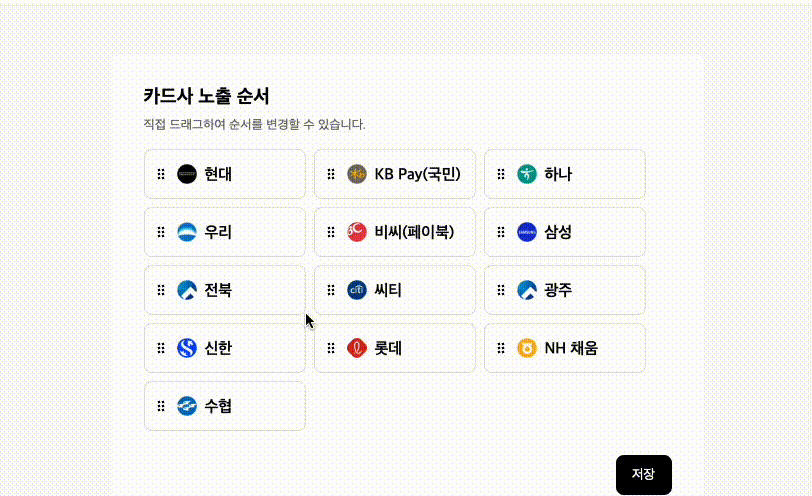

&nbsp;&nbsp;일반적으로 게임을 즐겨하는 사용자들이라면 drag and drop은 매우 익숙한 기능일 것이다. 그리고 또 모바일 앱을 이용하는 사람들도 해당 기능을 많이 접해보았을 것이다. **DnD**는 특정 요소들의 순서들을 재배치하거나 원하는 위치로 요소를 옮겨 보다 시각적으로 사용자에게 좋은 경험을 줄 수 있는 기능이라고 생각한다.

&nbsp;&nbsp;나는 취업을 준비하는 과정에서 과제전형을 준비한 적이 있었고, 해당 기업에서 제공한 과제의 기능 중 하나가 바로 **DnD**였다. 그래서 과제를 완성해서 제출한다는 것에 의미를 두기 보다는 해당 과제를 수행하면서 공부를 하는것에 중점을 두면서 과제에 임했다. 그리고 그 중에서도 **DnD**를 보다 자세하게 공부하게 되었다. **그리고 단순한 DnD가 아닌 grid 형태의 DnD를 구현해야 했다.**

---

#### Drag and Drop 직접 구현해 보자!!

&nbsp;&nbsp;처음 접근은 단순하게 생각했다. 과제 안내문에 나와있는 평가기준 중 하나인 **적재적소에 알맞은 라이브러리를 사용했는가?** 에 대한 글도 보았기 때문에 **라이브러리**를 사용하여 적용하면 되겠다고 생각했다. 그리고 참고자료를 찾아보는 와중에 **React Beautiful DnD**라는 유명한 **라이브러리**를 알게 되었고 솔직하게 그리 깊은 고민과 공부는 하지 않고 라이브러리를 설치하고 적용했다. 생각보다 문법은 간단했기 때문에 쉽게 적용이 되었다. 아 물론! 원하는 것처럼 **grid 형태의 dnd**가 적용된 것은 아니었지만 dnd가 정상적으로 동작은 했기 때문에 조금만 더 공부하고 수정하면 쉽게 적용될 것 이라는 생각이 들었다.

&nbsp;&nbsp;그리고 그때부터 지옥행 열차에 탑승하게 되었다. 순간 문득 든 생각이 바로 '적재적소에 라이브러리를 사용하는 것도 중요하겠지만 라이브러리를 설치하지 않고 직접 로직을 구현하는 하는 것이 용량도 줄이고 좋지 않을까?'하는 생각이 들었고 Drag와 관련된 이벤트들을 알아보기 시작했다. `dragOver`, `dragStart`, `dragLeave`, `dragEnter`, `dragEnd`와 같은 많은 **Drag Event**들을 제대로 알게 되었고 이것들을 잘 활용하면 직접 프로젝트에 grid 형태로 DnD 기능을 만들 수 있겠다고 생각했다.

**직접 만들기 위해 생각한 방식은 다음과 같다.**

1. dragLeave를 하면 drag되고 있는 요소를 'hidden'으로 만들어 숨긴다.
2. dragEnter이벤트가 발생했을 때 event.currentTarget 객체들을 이동되어야 하는 방향의 배열에 저장한다. ex)[...앞으로 한 칸 이동해야 하는 요소들], [...앞 줄로 이동해야 하는 요소들], [...뒷 줄로 이동해야 하는 요소들]
3. translate을 class 적용하여 사용자가 이동된 것처럼 느끼게 한다.
4. 그 후 dragEnd가 되면 배열의 요소들의 순서를 update하고 렌더링한다.
   라고 생각했고 초기에는 꽤 그럴듯 하게 만들어 진 것 같았습니다.

 
 

&nbsp;&nbsp;😵 그런데 문제는 지금부터 시작되었다. 저렇게 한 번도 움직인 적이 없는 요소들을 지나가면서 translate을 주고 그 상태에서 drop하여 데이터를 다시 올바른 순서에 맞게 update한 경우에는 정상적으로 동작하는 것처럼 보였다. 하지만 **드래그를 계속하면서 한 번 translate이 적용된 요소 위를(drop을 한적이 없는 상태) 또 지나가는 경우에는 요소들이 겹쳐서 보이기 시작했다.** 왜냐하면 dragEnter 이벤트의 이벤트 타깃 요소들은 전부 drag되고 있는 요소가 drop되기 전까지 translate이 적용되어 있기 때문이다. 예를들어 앞으로 한 칸 이동 translate이 적용된 요소위를 다시 지나가면 원래 자리로 되돌아와야 정상적으로 정렬된 것처럼 보이지만 배열이 초기화되지 않았기 때문에 그대로 translate이 적용되어 있는 것이다.

 
 

이러한 문제를 해결하는 방법으로는 dragEnter이벤트가 발생하면 그때마다 바로 데이터를 update를 하면 되겠다라고 생각했다. 하지만 이 방법으로도 계속 drag만 하고 있는 상태는 해결하기 어려웠다. 왜냐하면 데이터가 업데이트되기는 하지만 그에 따라 dragStart의 e.currentTarget의 값이 바뀌었기 때문이다. 즉, 계속 drop 없이 drag만 하고 있는 상태에서 중간에 데이터를 update하게되면 현재 **drag 되고 있는 것처럼 보이는 요소**와 **실제 drag 되고 있는 요소**가 일치하지 않는 문제가 생겼고 drop을 하여 데이터를 업데이트할 때 원하는 순서대로 데이터가 업데이트 되지 못하는 문제가 발생했다. 또한 dragEnter 이벤트를 기준으로 요소들이 어디로 translate 되어야 하는지 위치를 배열에 담아 설정했는데 배열이 계속해서 초기화되면서 translate 속성이 적용되지 않았다.

---

#### Drag and Drop 이렇게 해볼까?!!

그렇게 하루를 DnD와 씨름하다가 문득 다른 해결책이 떠올랐다. 지금 처럼 translate을 적용할 필요도 없고 약간의 편법(?)이 존재하는 방법이었다. 바로 실제로 drag 할 때는 요소를 빼내고 drop할 때는 요소를 붙여 넣는 것이다. 카드사 노출 순서 영역은 고정되어 있기 때문에 drap한 요소를 splice로 잘라내면 자동적으로 영역이 앞으로 밀려나가게 될 것이고 또 drop을 통해 요소를 추가하면 자동적으로 영역이 밀려나 원하는 drag and drop 기능이 구현될 것이라고 생각했다. 그리고 요소와 요소 사이에 drag하고 있는 요소를 올리면 사이가 벌어져야 하기 때문에 이를 위해서 각 요소들마다 **왼쪽/오른쪽**에 비어있는 **div**를 붙여주고 drag하고 있는 요소가 왼쪽이나 오른쪽 div 위로 올라오면 해당 왼쪽 또는 오른쪽 영역을 늘려주고 벗어나면 줄어들게 만드는 방법을 떠올렸다.

**처음에 영역을 늘리는 경우까지는 정상적으로 잘 동작했다.** 😭그러나 늘려놓은 div를 줄어들게 만드는 과정에서 예상한대로 동작하지 않았다. drag와 관련된 이벤트들이 굉장히 **민감하게** 움직였고 또 계속해서 많은 이벤트들이 발생하다보니 정상적으로 이벤트가 발생하지 않는 경우도 많았고 e.currentTarget의 값도 정상적으로 들어가지 않는 경우도 많았다. 또한 특정 위치에서는 지속적으로 **늘어났다, 줄어들었다**를 스파크 튀듯이 계속해서 반복되는 지점도 있었다. 그리고 또 다른 문제로는 과제 중 구현해야하는 기능들 중에 iframe에 실시간으로 dnd된 데이터들이 연동이 되어야 하는데 splice가 일어나면 해당 요소가 삭제되기 때문에 요구사항에도 맞지 않는 해결 방법이라고 생각했다.

그래서 결국 시간이 많이 흐르고 과제를 하기 위한 시간이 많이 줄어들자 점점 불안해 지기 시작했고, 그제서야 다시 라이브러리 적용을 고민하게 되었습니다. 하지만 처음부터 **얕게 알아본 결과** react beautiful dnd가 grid 형태의 dnd를 하기에는 아직 적합하지 않은 라이브러리라는 사실을 알게 되었다. 과제를 할 수 있는 시간이 이틀인가 남겨놓은 상태에서 이러한 상황을 맞자 사고회로도 제대로 돌아가지 않을 것 같아 dnd를 제외한 나머지 부분들부터 구현하기 시작했고 과제 제출일 당일에 **차선책**을 선택할 수 밖에 없었다.

---

#### translate의 적용은 못하지만 최대한 자연스럽게 drag and drop이 이뤄지는 것처럼 보이도록 UI를 구성하자!

시간이 점점 옥죄어 오자 오히려 더 어렵게 느껴지기 시작했다. 그리고 마음을 다 잡고 **'최대한 사용자가 Drag와 Drop을 자연스럽게 경험할 수 있도록 UI를 구성하자'** 라고 마음먹고 비록 drag하는 도중에 실시간으로 데이터가 변화되는 모습은 보이지 못하더라도 어색하지 않을 수 있게 만들기 위해 노력했다. 따라서 drag하는 요소가 지나갈 때는 해당 위치에 있는 요소를 **hidden**으로 만들고 다 지나가면 다시 **visible**이 되도록 만들었고, drop을 하는 경우에는 정상적인 순서로 렌더링 될 수 있도록 구현해 보았다. 비록 원래 원하던 모습대로 구현하지는 못했지만 나름대로 괜찮은 차선책을 만든것 같아 기분이 나쁘지만은 않았다. 이렇게 저의 우여곡절 DnD 만들기였다.

 
 

물론, 처음부터 라이브러리를 깊이 있게 알아보고 dnd에 대한 정보도 많이 찾아본 후에 천천히 고민하고 접근했다면 지금보다는 시간이 덜 걸렸거나 원하는 기능을 제대로 구현할 수 있지 않았을까 하고 후회는 남는다. 하지만 이번 기회를 통해 상황에 맞는 라이브러리를 알아보고 공부하여 적용하는것이 얼마나 중요한지도 알 수 있게된 시간을 보냈다고 생각한다.
