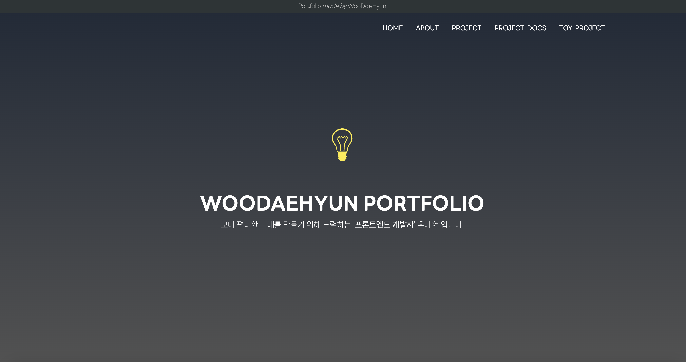

<br/>

&nbsp;&nbsp;이제 본격적으로 취업 준비를 하면서 **이력서**를 작성하게 되었고, **포트폴리오를** `pdf`형식으로만 만들어서 제출했었다. 하지만 이런 저런 다른 개발자들의 이력서 및 포트폴리오를 참고하는 과정에서 별도의 나만의 웹 포트폴리오를 만들면 좋겠다는 생각이 들었다. **프론트엔드 개발자**가 만든 **포트폴리오**는 많은 의미가 담겨 있다라고 생각하기 때문이다. **포트폴리오 웹 페이지** 자체가 현재 나의 역량을 보여줄 수 있는 `집합체(?)` 라고 생각하기 때문이다. 🚀

&nbsp;&nbsp;따라서 여러 UI적으로 유명한 사이트들을 참고해가며 `WOODAEFOLIO`를 만들기 시작했다!

---

### 1. 포트폴리오 바로가기

<br/>

<div align="center">
  <h3><a href="https://woodaefolio.com">🚀 WOODAEFOLIO 바로 가기</a></h3>
</div>
<br/>

---

### 2. 기술 스택

<br/>

<div align="center">


</div>
<br />

---

### 3. 폴더 구조

<br/>

```javascript
public
  L icons
  L images
src
  L app
  L components
      L Intro // 페이지 네비게이션 및 배경 이미지 등 설정
      L About // 나를 소개하는 부분
      L LinkBanner // 나와 관련된 Link 연결
      L ProjectList // 참여한 프로젝트 소개
      L ProjectDocs // 참여한 프로젝트와 관련된 문서 연결
      L ToyProjectList // 수행한 토이 프로젝트 소개
      L Bottom
      L Footer
data ...
```

<br />

---

### 4. 컴포넌트 분리 기준

<br/>

**`👻 섹션`**

- 포트폴리오를 만들면서 다양한 레이아웃과 다양한 UI를 담기 위해 노력했다. 따라서 UI 측면이나 기능적인 측면에서 중복되는 부분이 적었다.
- 이러한 이유로 각 컴포넌트들을 섹션 단위로 묶어 컴포넌트를 구성했다.
- ex) About 섹션, ProjectList 섹션 ... (위의 폴더 구조와 동일)

**`🐤 반복되는 UI 또는 기능`**

- 우선 섹션을 기준으로 컴포넌트를 분리하고 해당 섹션 내에서 반복되는 UI나 기능을 별도의 컴포넌트로 분리했다.

&nbsp;&nbsp;이러한 방법으로 컴포넌트를 분리하니 프로젝트를 전체적으로 이해하기 용이하다는 장점이 있었다. `section`별로 구분되어 있어 해당 `section`을 찾아내기 쉽웠고, 해당 `section` 내부에서 중복되는 부분들은 별도의 컴포넌트로 분리하여 유지보수 측면에서도 용이하다는 장점이 있었다.

&nbsp;&nbsp;물론 처음부터 공통으로 사용할 수 있는(ex button, banner의 style, section의 제목...) UI 컴포넌트를 설계하여 최대한 중복된 코드를 줄이고 컴포넌트의 재사용성을 높이는 방법으로 시작할 수도 있었으나, portfolio를 만드는 목표 기간을 1주일로 설정하였고, 디자이너가 없는 상황에서 `section`별로 어떤 UI로 보여줄지에 대한 생각이 시시각각으로 변하는 상황에서 처음부터 적용하기는 어려웠다. 하지만 코드의 중복을 제거하는것은 중요한 일이기 떄문에 리팩토링 과정을 거치면서 수정할 생각이다.

---

(작성중...)
