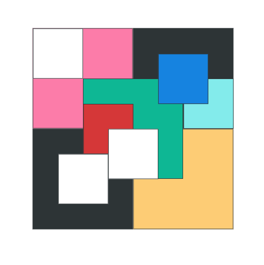

### 1. BOX LAYOUT

 

&nbsp;&nbsp;구글을 통해 `box-layout`을 검색해 보면 다양한 형태의 박스들이 배치된 이미지들을 볼 수 있다. 그리고 프론트엔드 개발을 하면서 많은 것들을 고민하면서 BOX들을 배치할 필요성을 느꼈다. **media-query**를 적용하거나 **전체적인 layout의 수정**을 가해야 하는 경우에 특히 이 필요성을 느낄 수 있었다. 따라서 특정 `box-layout` 이미지를 두고 직접 구현해보는 연습을 했다. 구현하고자 하는 레이아웃 이미지는 다음과 같다.

  

    
  

 
 

---

### 2. 구현 방법💡

 

코드를 작성하기 전 단계에서 생각한 방법은 크게 **두 가지**로 나뉘었다.

1. box 컴포넌트 만들고 props로 `size`를 전달하여 박스를 생성하는 방법
2. box 컴포넌트에 별도의 `size` props를 전달하지 않고 부모 컴포넌트를 기준으로 사이즈를 줄이는 방법

&nbsp;&nbsp;해당 프로젝트를 진행하면서 가장 중요하게 생각한 점은 `하나의 Box 컴포넌트`를 통해 **모든 Box들의 크기를 정하고 위치에 맞게 배치하면서도 코드의 양을 최대한 줄이는** 것이었다. 프로젝트를 구현하기 위해 참고해야 하는 이미지에는 중요한 규칙이 있었는데 바로 Box들의 크기가 부모 Box의 `1/4` 크기로 줄어든다는 점이다.

&nbsp;&nbsp;따라서 해당 규칙을 이용해 부모 자식 관계를 통해 box 안의 자식 box들의 크기를 별도의 props 없이 줄이는 방법을 선택했다. 또한 자식 box는 부모 박스의 정가운데를 기준으로 사전에 정의한 위치를 props로 넘겨 translate을 통해 원하는 곳에 위치시킬 수 있었다. **이를 통해 코드양을 많이 줄일 수 있었다.**

---

### 3. 구현 결과

<a href="https://github.com/WooDaeHyun/box-layout"><h6 style="text-align: center">Github Repo 바로가기</h6></a>

  

    
  

 

- 위어서도 언급했지만 해당 UI를 구성하는 방법에는 여러가지가 있겠지만 하나의 `Box 컴포넌트`를 통해 모든 Box들을 조작하게 하는 것을 목표로 설정하고 진행했다.
- `z-index`의 사용을 피하고자 정가운데를 기준으로 미리 정의해 둔 위치들을 기준으로 translate하여 Box들을 위치시켰다. `z-index`의 경우 설정 조건들이 꽤 까다롭다고 생각하고 코드를 유지 보수하는 측면에서도 가급적 지양하는 편이 좋다고 생각했기 때문이다.
- 그리고 자식 Box는 부모 Box의 정가운데를 기준으로 이동하게 되므로 **코드의 양을 많이 줄일 수 있고**, 이를 통해 가독성을 높일 수 있었다고 생각한다.

---

&nbsp;&nbsp;이번 연습을 통해 **box layout**을 원하는 위치에 배치시키는 방법들에 대해서 더 고민해 볼 수 있었던 기회가 되었다. 물론 중첩된 형식으로 box들을 배치시키는 서비스를 개발한 적은 없었지만 box들을 자유자재로 위치시키는 연습을 기반으로 더 나은 **box layout**을 구성할 수 있기 때문에 이러한 연습들이 필요하다고 생각한다.😁
