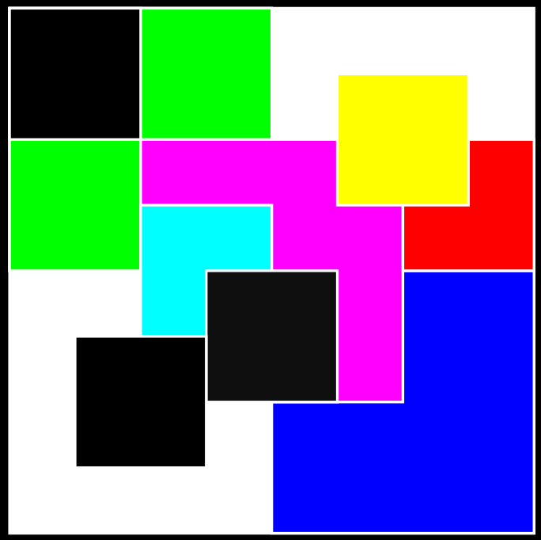
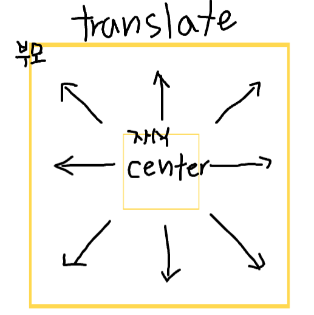

### BOX LAYOUT

 

&nbsp;&nbsp;구글을 통해 `box-layout`을 검색해 보면 다양한 형태의 박스들이 배치된 이미지들을 볼 수 있다. 그리고 프론트엔드 개발을 하면서 많은 것들을 고민하면서 BOX들을 배치할 필요성을 느꼈다. **media-query**를 적용하거나 **전체적인 layout의 수정**을 가해야 하는 경우에 특히 이 필요성을 느낄 수 있었다. 따라서 특정 `box-layout` 이미지를 두고 직접 구현해보는 연습을 했다. 구현하고자 하는 레이아웃 이미지는 다음과 같다.

  

    
  

 
 

---

### 💡 내가 생각한 구현 방식

 

&nbsp;&nbsp;해당 프로젝트를 진행하면서 가장 중요하게 생각한 점은 **코드의 양을 최대한 줄이고** `하나의 Box 컴포넌트`를 통해 **모든 Box들의 크기와 위치에 맞게 배치**시키는 것이었다. 그리고 프로젝트를 구현하기 위해 참고해야 하는 이미지에는 중요한 규칙이 있었습니다. 바로 Box들의 크기가 부모 Box의 `1/4` 크기로 줄어든다는 점입니다.

&nbsp;&nbsp;해당 규칙을 이용해 부모 자식 관계를 통해 box 안의 자식 box들의 크기를 별도의 props 없이 줄일 수 있었다. 또한 자식 box는 부모 박스의 정가운데를 기준으로 사전에 정의한 위치를 props로 념겨 translate을 통해 원하는 곳에 위치시킬 수 있었다. **이를 통해 코드양을 많이 줄일 수 있었다.**

